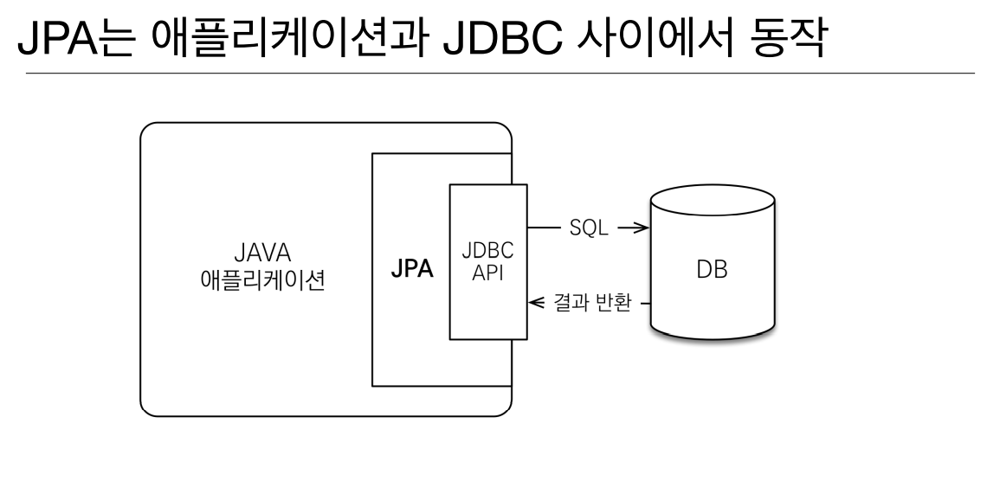
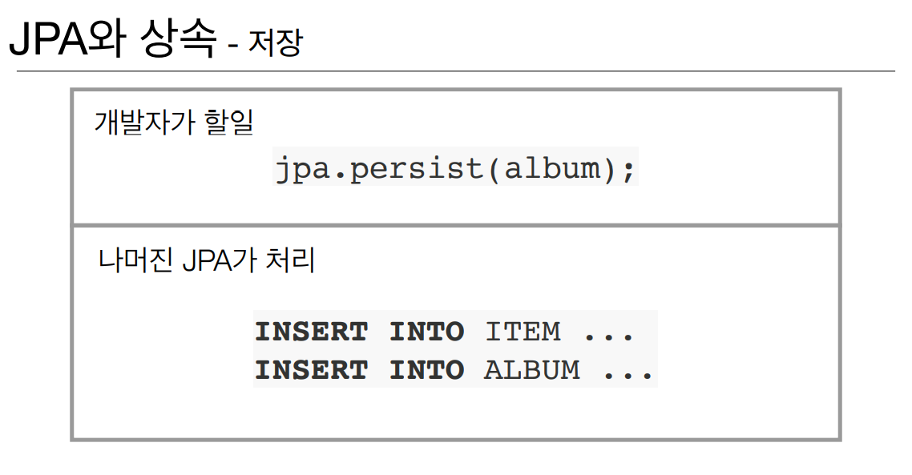
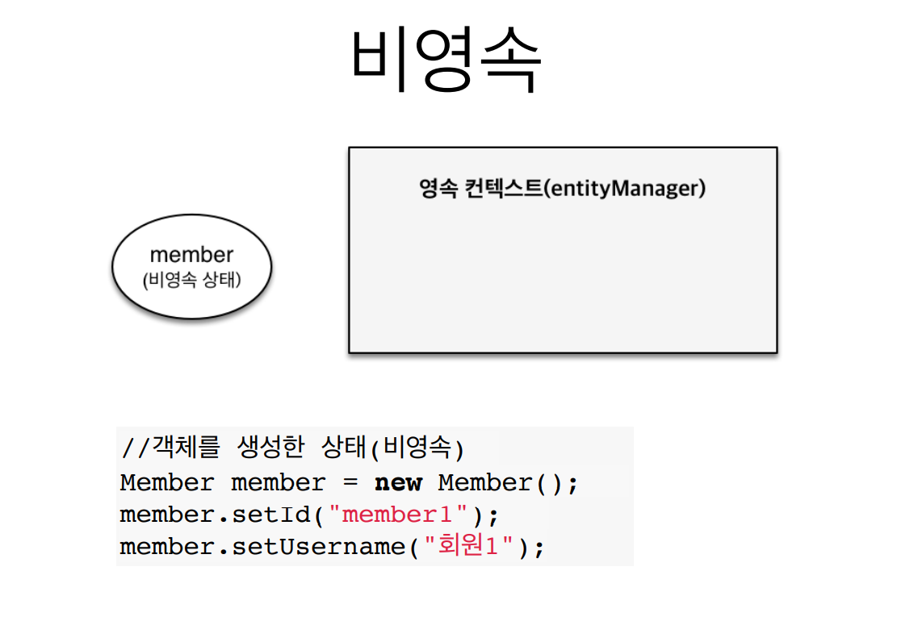
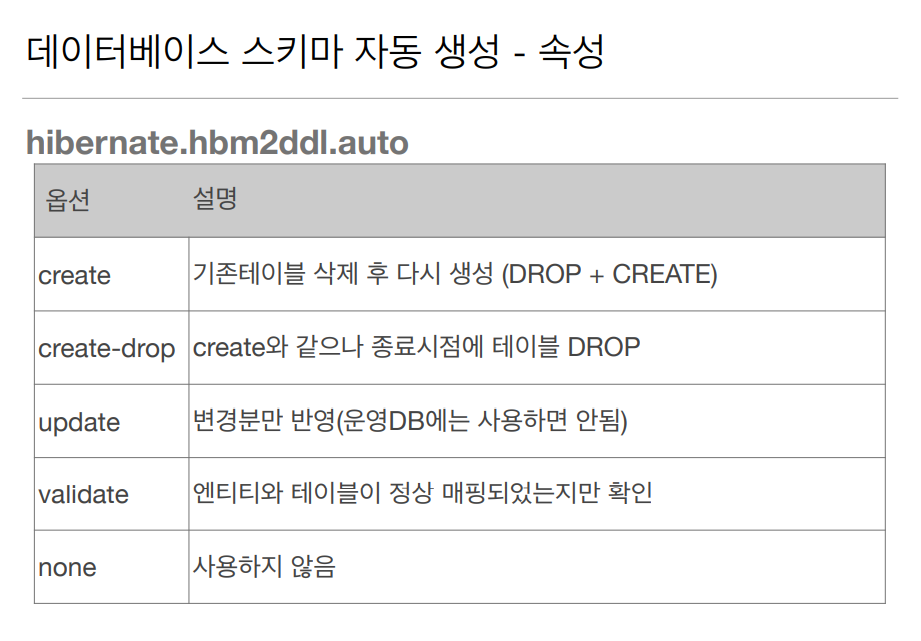
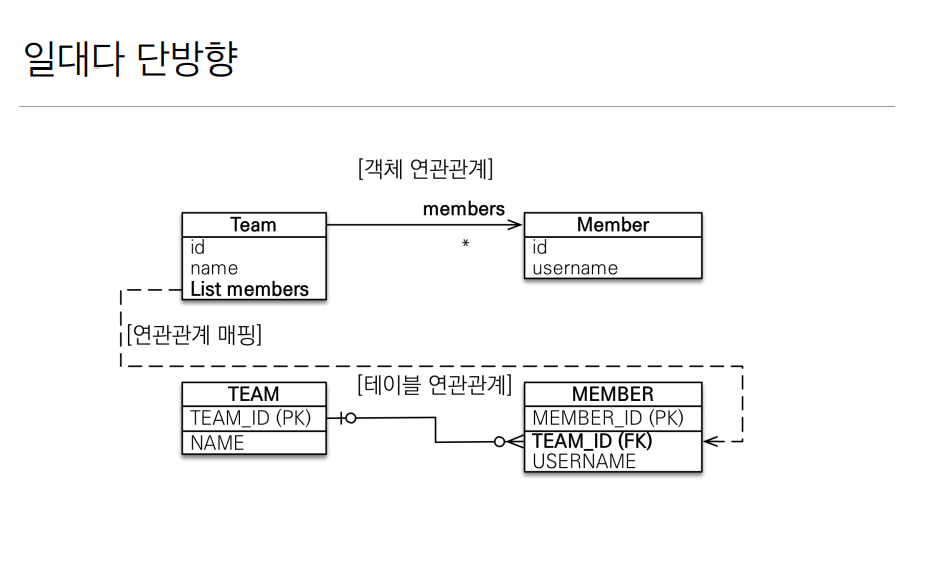
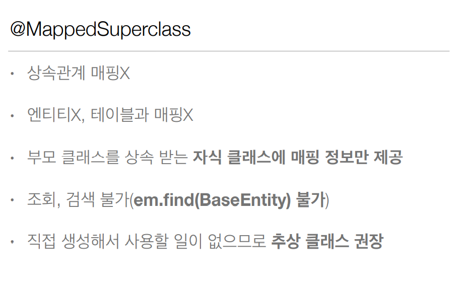
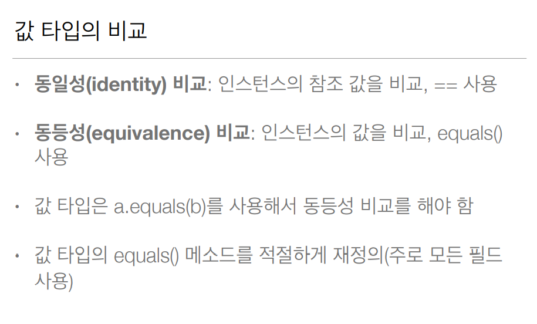
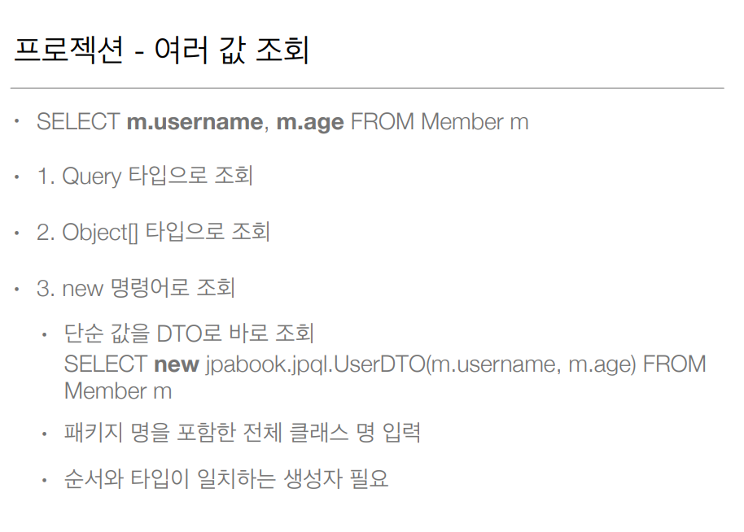

# 자바 ORM 표준 JPA 프로그래밍

***

### ORM이란?

Object Relational Mapping (객체 관계 매핑)

+ 자바의 객체를 관계형 데이터베이스에 어떻게 매핑해줄까 라는 고민이 많았음
    + 패러다임 불일치
+ 객체는 객체대로, 관계형 데이터베이스는 관계형 데이터베이스대로 설계하면
+ ORM 프레임워크가 중간에서 매핑
+ 대중적인 언어는 대부분 ORM이 존재

JPA는 이 ORM의 기능을 수행함



이렇게 JPA는 애플리케이션과 DB(JDBC) 사이에서 동작한다.

>객체를 저장할때는 JPA가 다음과 같이 동작한다.
>
> 


> 객체를 조회할때는 JPA가 다음과 같이 동작한다.
>
> 

***

### JPA의 CRUD

굉장히 간단하다.

+ 저장 : jpa.persist(member);
+ 조회 : Member member = jpa.find(member);
+ 수정 : member.setName("변경할 이름");
+ 삭제 : jpa.remove(member);

> 
> 
>
> + 위와 같은 관계에서, JPA를 쓰지 않고 JDBC로 insert를 한다면 프로그래머가 직접
    >   상속관계를 고려해서 super table에도 데이터를 insert 해주어야 한다.
> + JPA는 자동으로 insert를 2번 넣고 fk 등을 연결하기 때문에 편리하다.


또한 JPA를 사용하면 최적화적인 이점도 얻을 수 있다.

> 
> JDBC에서 한번에 SQL을 전송하고 싶다면 JDBC BATCH SQL이라는 것을 사용해야 하는데,
> 코드가 굉장히 지저분해진다고 한다.
>
> JPA를 사용하면 transaction 단위로 연산이 이루어지기 때문에 트랜잭션이 커밋되면
> 위에서 모인 연산들이 한번에 실행된다.  
> 어떤 원리인지 알아보자.
>
> + em.persist~~ 가 들어오면 JPA가 해당 명령어를 메모리에 차곡차곡 쌓아둔다.
> + transaction.commit이 이뤄지면 그때 메모리의 명령어들을 보고 같은 쿼리라면
    >   한번에 전송하여 처리한다고 한다.
>
>
> 
> 업데이트도 마찬가지.

### 지연 로딩과 즉시 로딩

***중요!!***


지연로딩 (LAZY) 이란?

예제에서 memberDAO.find(memberId)로 멤버 객체를 가져오면, 연관된 Team 객체는
가져오지 않고 후에 team.getName() 처럼 실제로 객체가 사용될때
Team 객체를 (매핑해서?) 가져온다. ***이것이 지연로딩***

만약 멤버 객체를 받을때 팀 객체를 사용하지 않는데 매번 함께 받아오게 된다면,
쿼리의 실행 횟수만큼 낭비가 발생할 것이다. 지연로딩은 이런 현상을 막아준다.


즉시로딩 (EAGER) 이란?

즉시로딩은 Member 객체를 호출할때, 연관된 Team 객체도 함께 가져오는 것이다.  
멤버 객체를 사용할때 보통 팀 객체도 함께 사용한다면, 즉시로딩으로 함께 가져오는 것이
바람직할 것이다.

***

## JPA 실습


JPA의 시작은 Persistence이다. Persistence를 생성하는 것으로 시작한다.

    package hellojpa;

    import javax.persistence.EntityManager;
    import javax.persistence.EntityManagerFactory;
    import javax.persistence.EntityTransaction;
    import javax.persistence.Persistence;

    public class JpaMain {
    public static void main(String[] args) {
        EntityManagerFactory emf = Persistence.createEntityManagerFactory("hello");

        EntityManager em = emf.createEntityManager();

        EntityTransaction tx = em.getTransaction();
        tx.begin();

        try {
            Member findMember = em.find(Member.class, 1L);
            findMember.setName("HelloJPA");
            // setName만 해두고 persist를 하지 않아도 DB에 값이 바뀌는 이유는
            // JPA가 트랜잭션을 커밋하기 전에 값이 바꼈는지 확인해보고 바뀐 값이 있다면 자동으로 바꿔주기 때문이다.
            tx.commit();
        } catch (Exception e) {
            tx.rollback();
        } finally {
            em.close();
        }

        emf.close();
      }
    }

+ 더티체킹 : 주석 참고
    + JPA는 트랜잭션을 커밋하기 전에 변경사항이 있는지 확인한다.
    + 변경사항을 만들고 persist로 저장하지 않아도 JPA가 더티체킹을 통해 자동으로 수정.

+ EntityManagerFactory, EntityManager는 Spring이 생성해준다.
    + 따라서 스프링을 사용할 때는 해당 객체를 볼 일이 없다.
    + 하지만 공부해둘것

***

## JPQL (맛보기)

          Member findMember = em.find(Member.class, 1L);
          // findMember.setName("HelloJPA");
          // setName만 해두고 persist를 하지 않아도 DB에 값이 바뀌는 이유는
          // JPA가 트랜잭션을 커밋하기 전에 값이 바꼈는지 확인해보고 바뀐 값이 있다면 자동으로 바꿔주기 때문이다.

            // JPQL : JPA에서 쿼리를 짤때 대상은 테이블이 절대 아니다. 객체가 대상이 된다.
            List<Member> result = em.createQuery("select m from Member as m", Member.class)
                    .setFirstResult(5)
                    .setMaxResults(8)
                    .getResultList();
            // JPQL을 활용하면 위처럼 페이징도 아주 간단하게 할 수 있다!

            for (Member member : result) {
                System.out.println("member = " + member.getName());
            }

            tx.commit();

+ JPQL은 간단히 말하면 객체지향 SQL
+ 테이블을 대상으로 작용하는 SQL이 아닌, ***객체를 대상으로*** 작용하는 SQL


***

## 영속성 컨텍스트

+ JPA를 이해하는데 ***가장 중요한*** 용어
+ "엔티티를 영구 저장하는 환경"이라는 뜻
+ EntityManager.persist(entity);
    + persist는 사실 DB에 저장하는 것이 아니라, entity를 ***영속성 컨텍스트***에
      저장한다는 뜻이다


***엔티티 매니저를 생성하면 그 안에 1대1로 영속성 컨텍스트가 함께 생성된다.***

여기서 엔티티의 생명 주기를 살펴보면,

+ 비영속 (new/transient)
    + 영속성 컨텍스트와 관계가 없는 새로운 상태

+ 영속 (managed)
    + 영속성 컨텍스트에 관리되는 상태

+ 준영속 (detached)
    + 영속성 컨텍스트에 저장되었다가 분리된 상태

+ 삭제 (removed)
    + 삭제된 상태

***



***


***


***

            // 비영속
            Member member = new Member();
            member.setId(100L);
            member.setName("James");

            // 영속
            System.out.println("=== Before ===");
            em.persist(member);
            System.out.println("=== After ===");

            tx.commit();

출력 결과를 보면 === Before === 와  === After === 사이에 어떠한 쿼리도 없다.  
JPA는 ***트랜잭션을 커밋할때 영속성 컨텍스트에 있는 것이 DB에 쿼리로 날아가는 것***이다.  
즉,
+ entityManager.persist를 통해 영속성 컨텍스트에 객체를 저장
+ transaction.commit으로 영속성 컨텍스트에 저장된 객체에 해당하는 쿼리 실행

***굉장히 중요한 개념. 꼭 알아두자***

### 영속성 컨텍스트의 이점은 다음과 같다.

+ ### 1차 캐시
+ ### 동일성(identity) 보장
+ ### 트랜잭션을 지원하는 쓰기 지연
  (Transactional write-behind)
+ ### 변경 감지 (***더티체킹!***)
+ ### 지연 로딩 (Lazy Loading)

***

## 1차 캐시

영속성 컨텍스트는 캐시의 역할도 수행한다.

entityManager.persist(entity) 를 통해서 영속화를 시키면, 아래와 같이 1차 캐시가 등록된다.


이렇게 캐시에 등록해둔뒤, 조회 상황에서


다음과 같이 캐시에 엔티티?가 존재한다면 DB까지 가지 않고 캐시에서 값을 바로 사용한다.

조회 상황에서 캐시에 값이 없다면,


위와 같이 DB에서 먼저 값을 조회한 뒤 1차 캐시에 저장한다.

하지만 트랜잭션 단위로 1차 캐시가 날아간다고 하니 사실상 크게 도움은 안된다.

***

    EntityManager em = emf.createEntityManager();
    EntityTransaction transaction = em.getTransaction();
    //엔티티 매니저는 데이터 변경시 트랜잭션을 시작해야 한다.
    transaction.begin(); // [트랜잭션] 시작
    em.persist(memberA);
    em.persist(memberB);
    //여기까지 INSERT SQL을 데이터베이스에 보내지 않는다.
    //커밋하는 순간 데이터베이스에 INSERT SQL을 보낸다.
    transaction.commit(); // [트랜잭션] 커밋


persist가 실행되고 영속성 컨텍스트에 저장이 된 뒤, 1차 캐시에 엔티티가 저장되고  
***쓰기 지연 SQL 저장소***에 관련 SQL이 차곡차곡 쌓인다.


그 후 트랜잭션이 커밋되면 DB에 SQL들이 flush 되면서 쿼리가 실행되는 순서이다.

이게 왜 장점이냐,
+ persist와 동시에 쿼리가 나가면 최적화를 할 수 있는 여지 자체가 없다.
+ JDBC batch라는 기능이 있는데, 쿼리를 한번에 여러개 날리는 기능이다.
+ < property name="hibernate.jdbc.batch_size" value="10" />
    + 최대 10개의 쿼리를 모아 한번에 보내겠다는 의미
    + 스프링을 쓰면 이렇게 직접 설정을 추가해줄 필요가 없으려나?
+ 버퍼링이 이런 식으로 구현이 될 수 있는데, 이것도 실제 환경에서 크게 이점을 기대하기는 힘들다고 한다.

***

## ***더티체킹***

    Member member = em.find(Member.class, 150L);
    member.setName("ZZZZZ");
이렇게 엔티티를 찾아와서 찾아온 엔티티의 이름을 바꾸면, em.persist를 해야 변화가 반영될 것 같지만 그렇지 않다.  
***JPA는 자바 컬렉션을 다루듯 데이터베이스를 다루는 것이 목적인데, 자바 컬렉션은 setter로 값을 바꾼 뒤 별도로 다른
행위를 하거나 하지 않는다. JPA도 똑같다. 변화가 발생하면 더티체킹이 일어나 자동으로 변화를 반영해준다.***


+ 1차적으로 트랜잭션 커밋 (flush)가 일어나면 JPA는 1차 캐시에 있는 엔티티들의 스냅샷을 떠둔다.
+ 변경이 일어나면 이 스냅샷과 값이 다를 것이고, JPA가 이를 인지해서 UPDATE SQL을 생성해서 쓰기 지연 SQL
  저장소에 저장한다.
+ 엔티티를 삭제해도 어쨌든 스냅샷에서 변경이 감지되므로 삭제가 반영이 된다.

### 플러쉬 (Flush)

방금 다뤘듯 flush가 일어나면 더티체킹이 일어난다.  
그럼 이 플러쉬는 어떻게 해야 일어날까??

+ em.flush - 직접 호출
    + entityManager.flush는 영속성 컨텍스트 내부에 존재하는 엔티티를 트랜잭션이 커밋되기 전에 수동으로
      반영하고 싶을때 사용한다.
+ 트랜잭션 커밋 - 플러쉬 자동 호출
+ JPQL 쿼리 실행 - 플러쉬 자동 호출
    +     em.persist(memberA);
          em.persist(memberB);
          em.persist(memberC);
          //중간에 JPQL 실행
          query = em.createQuery("select m from Member m", Member.class);
          List<Member> members= query.getResultList();
          memberA, B, C가 아직 DB에 반영되지 않았는데 JPQL에서 이에 접근하려 하면 예기치 못한 오류가
          발생할 수 있으니 이를 방지하기 위해 JPQL 실행 전에는 flush가 일어난다고 한다.
    + 방금 persist한 엔티티를 JPQL에서 접근하지 않으면 사실상 flush를 할 이유가 없다.  
      이런 경우에는 flush 옵션을 commit등으로 지정하면 커밋할 때만 flush가 일어난다.

### 준영속은 일단은 생략

***

## @Entity

+ ###@Entity가 붙은 클래스는 JPA가 관리하는 클래스.
+ JPA를 사용해서 ***테이블과 매핑할 클래스는 @Entity가 필수***
+ ***기본 생성자 필수***
    + JPA가 동적으로 reflection이나 프록싱 등을 하기 위해선 기본 생성자가 필요하기 때문이다.
+ final 클래스, enum, interface, enum 클래스 등은 @Entity x
+ 저장할 필드에 final 사용 x

### @Table

+ 만약 DB의 테이블 명이 내부적으로 룰이 정해져있어서 Member와 같이 자바에서 사용하는 형식으로 사용을  
  못한다면(혹은 테이블과 객체의 이름을 서로 다르게 하고싶다면)   
  @Table(name = "tableName")으로 지정해줄 수 있다.

### 데이터베이스 스키마 자동 생성

JPA는 애플리케이션 로딩 시점에 DB 테이블을 생성해주는 기능도 지원한다.
+ 생성된 DDL을 운영단계에서는 쓰면 안됨, 개발단계거나 로컬PC에서 개발할때 도움이 된다고 함
+ 혹은 적절히 다듬어서 사용
+ < property name="hibernate.hbm2ddl.auto" value="create-drop" /> 설정을 추가해서 사용 가능
    + value에 여러가지 값들이 있지만, 참고만 해두고 필요할때 찾아서 쓰기
        + create
        + create-drop
        + update - 변경분만 반영
            + 만약 Member에 age라는 필드를 추가했는데 기존 테이블을 drop하고싶지 않고 alter만 하고싶다면  
              value를 update로 지정
            + 기존 필드를 삭제하는건 반영이 안된다. 추가만 반영됨.
        + validate - 엔티티와 테이블이 정상적으로 매핑되었는지만 확인
        + none - 사용하지 않음



스키마 자동 생성과 관련한 중요한 사항이 있는데, 아래를 참고하자.


+ 개발 초기에는 create 또는 update를 써도 된다.
+ 테스트 서버는 update또는 validate
    + 테스트 서버에는 create를 쓰면 안된다.
    + ***테스트 해뒀던 데이터가 다 날아가기 때문.***
+ 스테이징과 운영 서버는 validate 또는 none을 써야한다.

***그런데 사실 시스템이 alter를 자동으로 짜고 실행한다는 행위 자체가 굉장히 위험하다고 한다.***  
결론은 로컬 PC에서만 create 또는 update 등 자유롭게 하고, 여러명이 쓰는 개발 서버나 스테이징,운영서버에서는  
가급적이면 쓰지마라!

### @Column

필드에 제약조건을 추가하거나 매핑명을 변경할때 사용된다.

ex :
+ 제약조건 추가 : 회원 이름은 필수, 10자 초과 x
    + @Column(nullable = false, length = 10)

+ unique 제약조건 추가
    + @Column(unique = true, ...)

***

## 매핑 어노테이션 정리

+ ### @Column : 컬럼 매핑
+ ### @Temporal : 날짜 타입 매핑
+ ### @Enumerated : enum타입 매핑
+ ### @Lob : BLOB, CLOB 매핑
+ ### @Transient : 특정 필드를 컬럼에 매핑하지 않음 (매핑 ignore)

### @Column

| 속성 | 설명 | 기본값 |
|--- | --- | ---|
| name | 필드와 매핑할 테이블의 컬럼 이름 | 객체의 필드 이름
| insertable,updatable| 등록, 변경 가능 여부 | TRUE
| nullable | null값의 허용 여부를 결정한다. false로 설정하면 not null 제약조건이 붙는다.
| unique | @Table의 uniqueConstraints와 같지만 한 컬럼에 간단히 유니크 제약조건을 줄때 사용한다.
| columnDefinition | 데이터베이스에 컬럼 정보를 직접 줄 수 있다. | 필드의 자바 타입과 방언 정보 사용
| length | 문자 길이 제약조건, String 타입에만 사용한다. | 255
| precision, scale | BigDecimal 타입에서 사용, precision = 전체 자릿수, scale = 소수의 자릿수 | precision = 19, scale = 2


+ unique는 잘 안쓴다. @Column에서 unique를 적용하면 이름이 이상한 랜덤값으로
  들어가게 되므로 가독성이 떨어져서 잘 안씀
+ columnDefinition의 예시는 다음과 같다.
    + @Column(columnDefinition = "varchar(100) default 'EMPTY'")

### @Enumerated


왜 EnumType.ORDINAL을 쓰면 안될까??

>만약 어떤 enum class에 0번이 USER, 1번이 ADMIN이라고 할때,  
위 시점에서 영속화되고 DB에 저장된 엔티티는 위 순서(0번 = USER, 1번 = ADMIN)를 따른다.
하지만 ***후에 GUEST가 추가되어서 0번이 GUEST로 바뀌게 되면, 그 뒤부터 추가된
엔티티들은 해당 순서(0번 = GUEST ... )를 따르게 된다.*** 기존 데이터가 가리키는 정보가
왜곡되는 상황.


### @Temporal

+ TemporalType.DATE : 날짜
+ TemporalType.TIME : 시간
+ TemporalType.TIMESTAMP : 날짜와 시간

+ #### LocalDate, LocalDateTime을 사용할 때는 생략 가능
    + 그래서 최신 스펙으로 개발할 때는 해당 어노테이션은 쓸 일이 없다고 한다.
    + ex :
      ```jsx
      private LocalDateTime time;

***

## 기본키 매핑


+ 직접 할당 : @Id
+ 자동 생성 : @GeneratedValue
    + 여러가지 전략이 존재한다.
        + @GeneratedValue = GenerationType.AUTO : DB 방언에 맞게 자동생성
            + 오라클이면 SEQUENCE, MYSQL이면 IDENTITY
        + 필드 타입은 Long이 좋다.

### 식별자 전략

+ 기본 키 제약 조건 : nullable = false, 변하면 안됨.
+ 미래까지 이 조건을 만족하는 자연키 (비즈니스적으로 의미있는 키)를 찾는 것은 어렵다.
+ 대리키(대체키)를 사용하자.
+ ex : 주문등록번호도 기본 키로 적절하지 않다.
+ ####권장 : Long형 + 대체키 + 키 생성전략 사용

***

# 양방향 매핑

테이블은 양방향 매핑이랄게 없다. 정확히는 방향이랄게 없다. foreign key 하나면 서로의 연관을 다 알 수 있다.

문제는 객체다. 객체에서는 단방향은 가능하지만 양방향 조회를 위해서는 별도의 리스트 등을 선언해줘야 한다.


```java
package hellojpa.jpabook.jpashop.domain;

import javax.persistence.*;
import java.util.ArrayList;
import java.util.List;

@Entity
public class Team {

    @Id
    @GeneratedValue
    @Column(name = "TEAM_ID")
    private Long id;

    private String name;

    @OneToMany(mappedBy = "team")
    private List<Member> members = new ArrayList<>();

    public Long getId() {
        return id;
    }

    public void setId(Long id) {
        this.id = id;
    }

    public String getName() {
        return name;
    }

    public void setName(String name) {
        this.name = name;
    }

    public List<Member> getMembers() {
        return members;
    }

    public void setMembers(List<Member> members) {
        this.members = members;
    }
}
``` 

위 코드는 @OneToMany(mappedBy = "team")에 의해서 양방향 매핑이 이루어졌다.  
여기서 Member 클래스의 @JoinColumn과의 차이점을 이해하는 것이 상당히 중요하다.

(Member class의 @JoinColumn)

```java
@Entity
public class Member {

  @Id
  @GeneratedValue(strategy = GenerationType.AUTO)
  @Column(name = "MEMBER_ID")
  // GeneratedValue의 strategy는 default가 AUTO
  private Long id;

  @Column(name = "USERNAME")
  private String username;

//    @Column(name = "TEAM_ID")
//    private Long teamId;


  @ManyToOne
  // Member가 N이고 Team이 1이다.
  // 따라서 @ManyToOne이 된다.
  @JoinColumn(name = "TEAM_ID")
  // 조인해야 하는 칼럼이 뭐냐? => TEAM_ID다!
  private Team team;
  // ...
}
```
@JoinColumn과 mappedBy의 차이를 이해하기 위해선, 객체와 테이블이 관계를 맺는 차이에 대해서
이해하고 갈 필요가 있다.

+ 객체의 경우 단방향 연관관계가 2개가 있는 것이다.
    + 멤버 => 팀
    + 팀 => 멤버
    + ***이렇게 단방향 연관관계 2개를 그냥 양방향 연관관계라고 하는 것이다.***

+ 테이블의 경우 외래키 하나로 양측 테이블의 연관관계 매핑이 끝난다.

이렇게 객체와 테이블의 매핑 방법 차이에 대해 먼저 알아놓자.

그리고 이어서 연관관계 주인에 대해 알아볼 필요가 있다.

## ***연관관계 주인***


위에서 설명한 객체의 양방향 매핑에 근거하여,  
만약 어떤 팀의 멤버를 바꾸고싶다면, 딜레마가 발생한다.  
***Team 객체에서 Member 필드를 바꿀지, Member객체에서 Team필드를 바꿀지.***  
이런 모호함 때문에 룰이 생긴다. 그게 바로 ***둘 중 하나로 외래키를 관리해야 한다는 것.***

### 양방향 매핑 규칙

+ 객체의 두 관계중 하나를 연관관계 주인으로 지정
+ ***연관관계의 주인만이 외래 키를 관리(등록, 수정)***
+ ***주인이 아닌쪽은 읽기만 가능***
+ 주인은 mappedBy 속성 사용 x
+ 주인이 아니면 mappedBy 속성으로 ***주인 지정***

그리고 아래의 코드를 보자.

```java
    
    @Entity
    public class Team {
      @OneToMany(mappedBy = "team")
      // mappedBy : 나는 "team"에 의해서 관리가 돼 : 
      // 여기서 이 team이 바로 @JoinColumn이 걸려있는 Member의 team 필드
      // 이 members 필드는 연관관계의 주인이 아니기 때문에 여기서 값을
      // 넣어봐야 아무 의미가 없다. 대신에 조회는 할 수 있다.
      private List<Member> members = new ArrayList<>();
    }
    
    @Entity
    public class Member {
      @ManyToOne
      // Member가 N이고 Team이 1이다.
      // 따라서 @ManyToOne이 된다.
      // 이 team이 연관관계의 주인이 된다, 즉 Member 객체가 연관관계의 주인이 된다.
      @JoinColumn(name="TEAM_ID")
      private Team team;
    }

```

# 누구를 주인으로 정할 것인가?

+ ###무조건!! ***외래키가 있는 곳을 주인으로 정해라***
+ ###***외래키는 1 대 N에서 N 쪽에 존재한다!***
+ ###즉 ***'다'의 관계에 위치한 녀석을 연관관계의 주인***으로 정해라!

+ 예제에서는 Member(N) Team(1) 이므로 Member를 연관관계의 주인으로 정한다.
+ 추가로 비즈니스적 가치와 헷갈리지 말길 바란다.
    + 자동차와 바퀴가 있으면 자동차가 비즈니스적으로 더 중요해보이지만  
      연관관계의 주인은 바퀴가 가져간다.

그래서 결론은,  
***@joinColumn은 연관관계의 주인 쪽에서 사용하고,  
mappedBy 옵션은 그 상대측에서 사용한다!***

***

## 양방향 매핑 주의할 점들

+ ### 연관관계 편의 메소드를 생성하자

```jsx
Team team = new Team();
 team.setName("TeamA");
 em.persist(team);
 Member member = new Member();
 member.setName("member1");
 //역방향(주인이 아닌 방향)만 연관관계 설정
 team.getMembers().add(member);
 em.persist(member);
```

위 예시는 연관관계의 주인이 아닌 쪽(Team)에서 값을 수정한 예시.  
Team에서의 Member 객체는 수정이 아닌 조회만 가능하므로 위 코드는 동작하지 않는다.  
따라서 ***Member.setTeam(team)*** 로 수정해야 한다.

하지만 ***순수 객체 상태***를 고려해서 항상 양쪽에 값을 설정해야 한다.  
즉 Member.setTeam(team) 과 team.getMembers().add(member) 를 동시에 해줘야 한다.  
그래야 순수 객체 상태로 인한 예상치 못한 오류 발생을 방지할 수 있고, 객체지향에 조금 더  
걸맞는 코드를 작성할 수 있기 때문이다.

> 순수 객체 상태
>
> Team 객체를 생성해둔 채로 persist 하면 1차 캐시에 해당 엔티티 정보가 들어가있고,
> 1차 캐시에 값이 존재하므로 JPA는 다시 DB에서 값을 불러오지 않기 때문에 순수 객체 정보만을
> 불러오게 된다고 함. 최악의 경우에는 이로 인해 버그도 발생할 수 있다고 함.


하지만 우리도 사람인지라 실수를 할 수 있기 마련이다.  
실수를 방지하기 위해서 가급적이면 연관관계 편의 메소드를 생성하는 것을 권한다고 한다.

```java
// Member 객체 내의 Team setter 
public class Member {
    // ...
  public void setTeam(Team team) {
      this.team = team;
      // 연관관계 주인이 아닌 쪽의 객체를 setter에서 일괄적으로 처리해줌.
      // 이렇게 하면 실수없이 처리할 수 있다.  
      team.getMembers().add(this);
  }   
}
```

요점은 반대쪽에 객체를 넣어주는 로직도 실수가 발생하지 않게 한번에 처리되게끔 설계하면 좋다는 것.
Team 쪽에서 addMember를 만들어서 처리하든 위 코드처럼 처리하든 관계가 없다.

+ ### 양방향 매핑시에 무한 루프를 조심하자

toString(), lombok, JSON 생성 라이브러리 사용시 주의

ex : Member에서 toString()을 쓰면 Team 객체를 필드로 가지고 있기 때문에
Team 객체의 toString()도 호출이 된다.  
이렇게 될 경우 Team에도 Member의 List가 필드로 존재하고 그 리스트 안에 존재하는
모든 Member 객체의 toString()을 또 모두 호출한다.  
***양쪽에서 toString()을 계속 호출하므로 무한루프 발생***

### JSON 생성 라이브러리에 대해

>Controller에서는 절대 Entity를 그냥 반환하지 말라고 한다.  
>컨트롤러에서 Entity를 반환하면 Spring이 이를 JSON으로 변환해서 뽑아주는데  
> 이렇게 할 경우 2가지 문제가 생긴다.
> + 첫번째로는 위에서 언급한 무한루프가 생길 수 있다고 한다.
    >   + 이유는 언급하지 않음. 아마 JSON이니까 무한 Depth 관련 문제인듯 함.
> + 두번째로는 엔티티를 변경하는 순간 그 API의 스펙이 바껴버린다고 한다.
>
> 따라서 엔티티는 단순히 값만 있는 DTO로 변환하여 반환하는 것을 추천한다.

### 양방향 매핑에 대해

***객체의 입장에서 양방향 매핑은*** 마냥 좋은 것이 아니다.
베스트는 단방향 매핑으로 끝낸다는 마인드로 설계하는 것. 실제로 그렇게 되면 가장 좋다.  
일단 단방향으로 설계를 끝내놓고 애플리케이션 단계에서 양방향을 필요에 따라 추가해도 늦지않음.

***

## 연관관계 매핑 예시


단방향 위주로 설계하고 필요하면 양방향으로 설계하라는게 무슨 뜻인지 살펴보자.  
위 사진과 같은 테이블 구조일때, Order 객체는
```java
@Entity
@Table(name = "ORDERS")
public class Order {
  //...
  @ManyToOne
  @JoinColumn(name = "MEMBER_ID")
  private Member meber;
  
  // 연관관계의 주인이므로 @JoinColumn으로 명시해준다.
  
  // ... 
}
```
위와 같이 @JoinColumn으로 걸어놔서 단방향 매핑으로 두고, ***필요하면 후에
Member객체에서 Order 리스트를 추가한 뒤 mappedBy로 양방향으로 만들어서 쓰라는
의미***인 것 같다.

추가로 개발상의 편의를 위해서 양방향 연관관계를 둔다는 것의 의미는,
연관관계의 주인이 아니라면 조회만이 가능하므로, 만약 MEMBER 테이블에서 리스트로
ORDERS 테이블의 요소들을 바로 모두 조회하고 싶다면 이때 양방향 매핑을 맺어서
쓰라는 의미이다.

+ 물론 강의에서는 Member를 보고 Order를 얻는 구조는 잘못된 구조라고 함.  
  이렇게 멤버에서 주문, 주문에서 상품, 상품에서 주문... 끝도 없이 물고 이어지는걸  
  현명하게 끊어내는 것이 굉장히 중요하다고 함.

덧붙여 실무에서는 JPQL이 굉장히 복잡해지고, 쿼리가 복잡해지면 아무래도 양방향으로 접근
가능한 것이 좋기때문에 양방향으로 두는 경우가 많다고 한다.


***

## 연관관계 매핑 시 고려사항

+ ### 다중성
    + 다대일 @ManyToOne
    + 일대다 @OneToMany
    + 일대일 @OneToOne
    + 다대다 @ManyToMany
    + 가장 앞 글자가 연관관계의 주인
+ ### 방향 (Direction)
+ ### 연관관계 주인

***

## 다중성

### 다대일

+ 외래 키가 있는 쪽(다)이 연관관계의 주인
+ 양쪽을 서로 참조하도록 개발

다대일에 대해서는 위에서 많이 알아보았다.

### 일대다

***실무에서 권장하는 구조는 아니라고 한다.***  
예시에서 Team 엔티티가 연관관계의 주인이 되는 구조인데, 이렇게 되면 다음의 문제가 발생한다.



Team 엔티티에서 Member 리스트가 업데이트되면, TEAM 테이블이 변경되었음에도 불구하고  
MEMBER 테이블에서도 변경이 발생되어야 한다. 즉 쿼리가 하나가 더 실행되어야 한다.  
***굉장히 비효율적인 구조***
+ 일대다 관계는, 객체와 테이블의 차이 때문에 반대편 테이블의 외래키를 관리해야 하는  
  아주 특이한 구조.

추가로 본인의 테이블이 아닌 옆테이블에 쿼리가 날아가는 구조 자체가 개발자에게도 혼란스럽고
객체지향적으로도 맞지 않다.

일대다도 단방향 양방향 모두가 지원 되지만 공식적으로 지원하지 않는다고 하니 넘어가자  
(@joinColumn(insertable = false, updatable = false)를 통해서 구현됨)

### 일대일

일대일관계는 특이하게 주 테이블이나 대상 테이블 어느 곳에나 외래 키를 선택할 수 있다.

다음과 같이 1대1 연관관계를 가지는 Member와 locker 엔티티가 있다고 가정하자.


이렇게 되면

+ 그림과 같이 MEMBER 테이블에 LOCKER_ID를 외래키 + 유니크로 둬도 되고,
+ 반대로 LOCKER 테이블에 MEMBER_ID를 외래키 + 유니크로 둬도 된다.

```java
@Entity
public class Locker {

    @Id @GeneratedValue
    private Long LockerId;

    private String name;

    @OneToOne(mappedBy = "locker")
    // 누가 주인이 돼도 상관없다.
    // Member 쪽의 locker에서 mappedBy = "member"가 되어도 된다.
    private Member member;
}
```

그런데 일대일 매핑에서 외래키를 누구로 둘지도 약간 고민의 여지가 있는데,  
예를 들어 시간이 흘러서 한 회원이 여러개의 락커를 가져도 된다고 룰이 업데이트 되면
아래의 그림처럼 LOCKER 측에서 MEMBER_ID를 가지고 있는 것이 좋다.


UNI 옵션만 drop 해버리면 이전과 똑같이 운영할 수 있기 때문.  
일대일 매핑에서 어느 쪽을 외래키로 잡아도 상관 없다고는 하지만 이런 것들은 잘 고려해야함.

### 일대일 정리

>
>
>여기서 주 테이블은 주로 많이 access하는 테이블이라고 한다.  
>주목할 점은 대상 테이블에 외래키를 뒀을 때 단점으로 프록시를 사용하지 못한다는 것인데,  
>지연로딩 기능을 사용하기 위해서는 프록시를 통해 가상의 값으로 특정 필드를 치환해야 하는데,
>그렇게 하기 위해 JPA는 먼저 그 값이 존재하는지를 조사하게 된다.
>
>하지만 아래와 같은 그림을 보면,
>
>
>Member 객체에서 LOCKER에 값이 있는지 없는지 MEMBER 테이블만 봐서는 모른다.  
>어차피 LOCKER를 뒤져서 MEMBER_ID에 값이 있는지 없는지 where 절로 찾아서 값이 있어야
>Member의 locker가 프록시 허용이 되고 지연로딩이 될 수 있는 것이다.  
>하지만 어쨌든 값을 조사하기 위해 쿼리가 나가기 때문에 지연로딩의 이점을 살릴 수 없다.  
>따라서 대상 테이블(LOCKER)에 외래키가 존재하면 지연로딩을 사용할 수 없다.
>
>주 테이블(MEMBER)에 외래키가 존재한다면 그냥 자기 테이블에서만 확인하면 되니까
>위와 같은 문제는 고려할 필요가 없다!
>
>==> 그래서 강의에서는, 본인은 주테이블에 외래키를 두는걸 좋아하지만 DBA들이 싫어할 수도
>있다고 하니 충분한 소통을 통해 협의를 보라고 한다.


### 다대다

***다대다는 안된다~~***  
테이블은 다대다 매핑이 안됨. 중간에 중계 테이블을 둬서 다대일, 일대다로 풀어줘야함.
반대로 객체는 다대다 매핑이 됨. 그냥 양쪽에 서로의 리스트를 두면 되는 것.  
추가로 @ManyToMany, @JoinTable(name = "테이블 명")을 넣어줘야 하지만
### "***어차피 안씀.***"

다대다를 왜 쓰면 안되는지 정도만 이해하고 넘어가자.

+ 연결 테이블이 단순히 연결만 하고 끝나지 않음
+ 주문시간, 수량 같은 데이터가 들어올 수 있음
    + 추가 데이터 : "이 데이터 언제 들어왔어, 수량 몇개야 ... "
    + 이런 추가 데이터가 들어올 수 있는데 다대다 매핑은 이런 것들이 추가가 안된다고 함.


***

#### 매핑 예제

#### 번외로 셀프 매핑의 경우는 아래 사진의 Parent 처럼 할 수 있다.


<추후에 직접 작성한 매핑 정보를 여기에 작성하도록 하겠다.>


***

## 고급매핑 - 상속관계 매핑

관계형 DB에는 상속관계가 없다.  
하지만 상속관계와 그나마 비슷한 Super 타입, Sub 타입이 존재한다.  
그래서 이를 이용하면 다른 DB와 다르게 상속관계를 매핑할 수 있다.

상속관계 매핑에는 3가지 방법이 있다.

+ ### 조인 전략 (각각 테이블로 변환)
  
+ ### 단일 테이블 전략 (통합 테이블로 변환)
  
+ ### 구현 클래스마다 테이블 전략 (서브타입 테이블로 변환)
  
+ #### @DiscriminatorColumn(name=“DTYPE”)
    + DTYPE은 식별자로, 상위에 있는 테이블의 필드가 어떤 하위 테이블로 인해
      추가된 것인지 식별하기 위해 존재하는 컬럼이다.

***

### 조인전략

+ @Inheritance(strategy=InheritanceType.JOINED)
    + 예시에서 Item 엔티티에 위 애노테이션을 붙여주면 된다.
+ 정규화된 구조이다.
+ 객체와 가장 유사한 구조이기도 하다.
+ 정석으로 생각하면 된다.

> #### 조인전략의 장점
> + 테이블 정규화
> + 외래 키 참조 무결성 제약조건 활용가능
    >   + ex) 주문이라는 테이블에서 외래키 참조로 Item을 봐야하면
          >   Item(상위테이블)하나만 보면 된다.
> + 저장공간 효율화
>
> #### 조인전략의 단점
> + 조회시 조인을 많이 사용
> + 조회 쿼리가 복잡함
> + 데이터 저장시 INSERT SQL 2번 호출
>
> ***
> 위의 단점들은 그렇게 큰 단점은 아니라고 한다.
> ### ***단일 테이블 전략에 비해 복잡한 것이 최대 단점***

***

### 단일 테이블 전략

+ @Inheritance(strategy=InheritanceType.SINGLE_TABLE)
+ JPA의 기본 전략이다.
+ ***DTYPE이 꼭꼭 필수로 생성이 되어야 한다.***

> #### 단일 테이블 전략의 장점
> + 조인이 필요 없으므로 일반적으로 조회 성능이 빠름
> + 조회 쿼리가 단순함
>
> #### 단일 테이블 전략의 단점
> + 치명적인 단점 : ***자식 엔티티가 매핑한 컬럼은 모두 null을 허용해줘야 함.***
    >   + 예시에서는 Id(PK), NAME, PRICE를 제외한 모든 필드를 nullable로 설정해야함
> + 단일 테이블에 모든 것을 저장하므로 테이블이 커질 수 있다.
    >   상황에 따라서는 조회 성능이 오히려 느려질 수 있음

***

### 구현 클래스마다 테이블 전략

+ @Inheritance(strategy=InheritanceType.TABLE_PER_CLASS)
+ 크나큰 문제가 하나 존재함
    + item이라는 상위 테이블이 존재하지 않는 구조이다 보니 Union으로
      모든 테이블을 다 조사한다.
+ ###***쓰지 말아야 할 전략***

***

### 그렇다면 어떤 상속 전략을 써야할까?

#### ***확장할 일이 없어보이고 단순해보이면 단일 테이블 전략을,***
#### ***구조가 정교해야하거나 단순하지 않고, 비즈니스적으로 중요하다면 조인 전략을 써라!***


***

### @MappedSuperClass

만약 공통된 속성이 있다고 가정하자.  
예를 들어 모든 테이블의 칼럼에 누가 언제 해당 테이블을 만들거나 수정했는지 확인하려면,

```java
private String createdBy;
private LocalDateTime createdDate;
private String lastModifiedBy;
private LocalDateTime lastModifiedDate;
```
위의 코드를 모든 엔티티 클래스에 넣어줘야 한다.  
하지만 이렇게 하지않고 저 기능을 수행해주는 속성을 따로 만들어 그걸 상속받아서 쓴다면
유지보수도 훨씬 편하고 깔끔할 것이다.

BaseEntity 클래스를 만들어 위 코드를 속성 필드로 두고, 이걸 상속하므로서 해당 속성들을
쓸 수 있게 된다. 그리고 BaseEntity에 @MappedSuperClass를 붙여준다.

***즉 @MappedSuperClass는 그냥 속성들을 정의해두고 그 속성을 공통으로 쓰고 싶을때
상속받아 사용할 수 있게 해주는 용도로 이해하면 된다!***



중요한건 마지막, 추상 클래스로 만들어야하는걸 권장한다는 것이다.

### ***@MappedSuperClass는 많이 쓴다고 하니 잘 기억해두자!***

*** 


### 상속관계 매핑 예제

> 요구사항 :
> + 상품의 종류는 음반, 도서, 영화가 존재하고 이후 더 확장될 수 있다.
> + 모든 데이터는 등록일과 수정일이 필수로 존재해야한다.
>
> 기존 도메인에 상속관계를 가지는 ITEM 테이블이 추가되는 그림은 다음과 같다.
>
> 
>
> 테이블은 다음과 같이 설계된다.
>
> 
>
> 주목할 점은 ***상속관계 매핑 전략을 단일 테이블로 설정했다는 것이다.***
> 테이브 설계를 보면 ITEM 테이블에 모두 모여있음을 확인할 수 있다.
```java
  package hellojpa.jpabook.jpashop.domain;
  
  import javax.persistence.*;
  
  @Entity
  @Inheritance(strategy = InheritanceType.SINGLE_TABLE)
  @DiscriminatorColumn  // 식별자 DTYPE 칼럼을 만들기 위함
  public class Item {
  
      @Id @GeneratedValue
      @Column(name = "item_id")
      private Long id;
  
      private String name;
      private int price;
      private int stockQuantity;
  
      public Long getId() {
          return id;
      }
  
      public void setId(Long id) {
          this.id = id;
      }
  
      public String getName() {
          return name;
      }
  
      public void setName(String name) {
          this.name = name;
      }
  
      public int getPrice() {
          return price;
      }
  
      public void setPrice(int price) {
          this.price = price;
      }
  
      public int getStockQuantity() {
          return stockQuantity;
      }
  
      public void setStockQuantity(int stockQuantity) {
          this.stockQuantity = stockQuantity;
      }
  }
```

+ Item의 하위 도메인들은 기존처럼 구현할 수 있고, 상위인 ITEM 엔티티는
  위와 같이 구현된다.

```java
package hellojpa.jpabook.jpashop.domain;

import javax.persistence.MappedSuperclass;
import java.time.LocalDateTime;

@MappedSuperclass
public abstract class BaseEntity {

    private String createdBy;
    private LocalDateTime createdDate;
    private String lastModifiedBy;
    private LocalDateTime lastModifiedDate;

    public String getCreatedBy() {
        return createdBy;
    }

    public void setCreatedBy(String createdBy) {
        this.createdBy = createdBy;
    }

    public LocalDateTime getCreatedDate() {
        return createdDate;
    }

    public void setCreatedDate(LocalDateTime createdDate) {
        this.createdDate = createdDate;
    }

    public String getLastModifiedBy() {
        return lastModifiedBy;
    }

    public void setLastModifiedBy(String lastModifiedBy) {
        this.lastModifiedBy = lastModifiedBy;
    }

    public LocalDateTime getLastModifiedDate() {
        return lastModifiedDate;
    }

    public void setLastModifiedDate(LocalDateTime lastModifiedDate) {
        this.lastModifiedDate = lastModifiedDate;
    }
}

```

요구사항에 주어진 공통 속성을 제공하는 BaseEntity는  
@MappedSuperClass 애노테이션을 활용하여 위와 같이 구현할 수 있다.

#### 다대다를 해소하는 중간 테이블에는 저런 공통 속성들이 적용되지 않는다.
#### 그것이 우리가 다대다 매핑을 사용하면 안되는 이유이다.

***그런데 이렇게 테이블 상속을 고려하는 경우는 트레이드 오프를 잘 따져야한다고 한다.***
+ ***데이터 수가 굉장히 많아서 DB를 파티셔닝 해야하고... 이런 상황이 발생한다면***
  ***고려할 것들이 확 늘어난다고 한다. 이런 경우는 ITEM 테이블에서 모두 처리하고
  하위 아이템 정보는 JSON으로 처리하는 경우도 있다고 함!***

+ 데이터가 많아질 경우에는 당연하지만 테이블을 단순하게 유지하는게 정답이다.
  상속관계를 고려하면 테이블이 복잡해지므로 Trade-off를 잘 고려하자.

***

## 프록시

### em.find() vs em.getReference()

+ #### em.find() : 데이터베이스를 통해서 실제 엔티티 객체 조회
+ #### em.getReference() : ***데이터베이스 조회를 미루는 가짜(프록시)엔티티 객체조회***
    + #### 이게 가능한 이유는 영속성 컨텍스트의 도움을 받기 때문.
> ####Member 엔티티를 얻어오는 방법은 다음과 같은 두가지 방법이 있다.
>
> + Member findMember = em.find(Member.class, member.getId());
    >   + em.find()의 경우 실행 즉시 쿼리가 실행된다.
> + #### Member findMember = em.getReference(Member.class, member.getId());
    >   + em.getReference의 경우 실행 시점에 쿼리가 실행되지 않는다.
>   + findMember.getId() 와 같이 ***받아온 참조(findMember)를 사용할때 실질적으로
      >     쿼리가 실행된다.***
>   + findMember의 경우 프록시, 즉 가짜 객체이다.

### 프록시 객체의 구조

+ 프록시는 실제 클래스를 상속 받아서 만들어진다.
+ 그러므로 실제 클래스와 겉모양이 같다.

#### Member findMember = em.getReference(Member.class, member.getId());
em.getReference()를 통해 프록시 객체를 초기화한다.

findMember.getName() 과 같이 프록시 객체가 실제로 사용될때, 프록시 객체는

***위와 같이 가지고있던 실제 엔티티에 대한 참조를 사용해서 실제 객체의 메소드를 호출한다.***

### ***프록시의 특징<중요★>***
+ 프록시 객체는 처음 사용할 때 한 번만 초기화
+ 프록시 객체를 초기화 할 때, ***프록시 객체가 실제 엔티티로 바뀌는 것은 아니다.***
    + ***프록시 객체를 통해서 실제 엔티티에 접근 가능하게 되는 것.***
    + 프록시 객체가 실제 엔티티로 바뀌는게 아니라는 것 기억하기!
    + 이게 왜 중요할까? 아래 항목 참조
+ 프록시 객체는 원본 엔티티를 상속받음, 따라서 타입 체크시 주의해야함.
    + == 비교는 false 반환, ***instance of***를 사용해야 함.
+ 영속성 컨텍스트에 이미 엔티티가 존재하면, em.getReference()를 호출해도 실제
  엔티티가 반환된다.
    + 역도 성립한다. 이미 프록시가 먼저 존재하면, find()로 실제 객체를 찾아도
      프록시로 저장된다.
    + 이유1. ***이미 1차 캐시에 실제 엔티티가 존재하는데 이걸 프록시로 만들어봐야
      아무 이점이 없다.***
    + 이유2. JPA는 한 영속성 컨텍스트 안에서 가져왔고 PK가 똑같으면 (같은 엔티티라면)
      항상 true를 반환해줘야한다고 한다.
        + 같은 이유로, Member를 getReference()로 2번 가져온다면 이 2개의 엔티티는
          완벽히 동일한 프록시 객체가 된다. a === a
+ ***영속성 컨텍스트의 도움을 받을 수 없는 준영속 상태일때,프록시를 초기화하면 문제가 발생한다.***
    + > Member refMember  = em.getReference(Member.class, id);  
      em.detach(refMember);  
      refMember.getUsername();
    + 위의 경우에 예외가 발생한다. getUsername()은 영속성 컨텍스트의 도움을 받아
      실제 엔티티에서 얻어와야 하는데, 준영속 상태이기 때문에 예외가 발생함
    + #### ***실무에서 정말정말 많이 만나는 예외라고 한다.***
    + #### ***org.hibernate.LazyInitializationException***

***

### 즉시 로딩과 지연 로딩

즉시 로딩과 지연 로딩이 무엇인지는 앞에서 다뤘으므로 생략하도록 하겠다.

#### 즉시 로딩의 설정은 아래와 같다.
```java
@Entity
 public class Member {
   @Id
   @GeneratedValue
   private Long id;
   @Column(name = "USERNAME")
   private String name;
   @ManyToOne(fetch = FetchType.EAGER) //**
   @JoinColumn(name = "TEAM_ID")
   private Team team;
 }
```

#### 지연 로딩의 설정은 아래와 같다.

```java
@Entity
 public class Member {
   @Id
   @GeneratedValue
   private Long id;
   @Column(name = "USERNAME")
   private String name;
   @ManyToOne(fetch = FetchType.LAZY) //**
   @JoinColumn(name = "TEAM_ID")
   private Team team;
 }
```

이와 관련된 중요한 주의사항이 있다.

+ ### ***가급적 지연로딩만 사용하기(특히 실무에서!!)***
    + #### Member만 em.find()로 찾았는데 Team 까지 불러와져서 예상치 못한 SQL이 대거 발생한다.
+ ### ***즉시 로딩은 JPQL에서 N+1 문제를 일으킨다!***
    + > 만약 em.createQuery("select m from Member m", Member.class) 라는
      > JPQL이 있다고 하면, 즉시 로딩 방식은 N+1 이라는 고질적인 문제를 겪는다.
      >
      > 즉 "Select m from Member m" 의 실행 결과로 member를 가져왔는데,  
      가져오고 보니 member는 EAGER 라서 TEAM 객체도 함께 가져와야 하는 상황인 것이다.
      따라서 JPQL은 1번만 실행되었더라도 쿼리는 2번이 실행되는 현상이 발생한다.  
      또한 팀과 멤버가 여러개가 되면 쿼리가 1번만 추가로 실행되는 것이 아니라
      N번 (여러번) 추가로 실행될 수 있다. 이것을 N+1 문제라고 정의한다.
+ ### ManyToOne, OneToOne은 기본 설정이 ***즉시로딩***이다.
    + 반드시 직접 지연로딩으로 바꿔주도록 하자.
+ ### OneToMany, ManyToMany는 기본이 지연 로딩이다.


그래서 결론이 뭐냐, 사진 한장으로 알아보겠다.


#### <추가>

> OneToOne 양방향 매핑에서 연관관계의 주인이 아닌 쪽에서 조회하게 되면
> 프록시 객체를 생성할 수 없기 때문에 지연 로딩으로 설정해도 즉시 로딩으로
> 동작하게 된다.
>
> ***그 이유는 프록시는 null을 감쌀 수 없기 때문에 참조하고 있는 객체가 null인지 null이 아닌지
> 확인하는 쿼리를 실행해야 하기 때문이다.***

***

### 영속성 전이 : CASCADE

***영속성 전이란?***

+ #### 특정 엔티티를 영속 상태로 만들 때 연관된 엔티티도 함께 영속 상태로 만드는 것.
+ #### 예) 부모 엔티티를 저장할 때 자식 엔티티도 함께 저장
    + cascade가 없다면 부모를 persist 후 모든 자식들을 일일이 persist 해줘야 한다.
    + 부모 쪽에서 매핑을 할때 다음과 같이 코드를 추가하면 된다.
        + ```java
      @OneToMany(mappedBy = "parent", cascade = CascadeType.ALL)
      private List<Child> childList = new ArrayList<>();
      ```
+ #### 영속성 전이는 연관관계를 매핑하는 것과는 아무련 관련이 없다.
+ #### 대상을 영속화할 때 연관된 엔티티도 함께 영속화 하는 편리함을 제공할 뿐.

***영속성 전이를 쓰면 안되는 상황이 있다.***

위 예시처럼 하나의 Parent 엔티티가 Child들을 관리하면 사용할 수 있지만,  
만약 Child가 Parent 뿐만 아니라 다른 엔티티와도 연관이 있다면 cascade는 사용해선
안된다. : Parent에서 수정해서 모든 Child에 반영이 됐는데, Child와 관련이 있는
또 다른 엔티티인 Member 입장에선 갑자기 모든 Child가 수정되기 때문이다.

***

### 고아객체

+ ***부모 엔티티와 연관관계가 끊어진 자식 엔티티를 뜻한다.***

+ ***예시에서는 Parent가 가지고 있는 List< Child > 중에서 하나를 지울 경우 그 지워진
  Child가 고아엔티티가 된다.***
    + 즉 부모엔티티의 컬렉션에서 제거된 자식 엔티티가 고아객체가 된다.
+ 고아객체 제거는 cascade를 설정하는 곳에서 함께 옵션으로 설정할 수 있다.
```java
      @OneToMany(mappedBy = "parent", cascade = CascadeType.ALL, orphanRemoval = true)
      private List<Child> childList = new ArrayList<>();
```
#### orphanRemoval = true


***고아객체 자동 제거도 사용에 주의해야할 상황이 있다!***

+ #### 참조하는 곳이 하나일 때 사용해야한다.
    + 다른 엔티티가 참조하고 있다면 그 엔티티의 입장에서는 쌩뚱맞게 엔티티가 삭제된 상황
+ #### 특정 엔티티가 개인 소유할 때 사용

영속성 전이(cascade)와 고아객체 제거를 함께 사용하면,  
***부모 엔티티를 통해서 자식 엔티티의 생명주기를 관리할 수 있다.***  
이는 도메인 주도 설계의 Aggregate Root개념을 구현할때 유용하다고 한다. 일단은 참고만.

***

## JPA의 기본값 타입

+ ### 엔티티 타입
    + 식별자가 존재하여 데이터가 변해도 지속해서 추적 가능
+ ### 값 타입
    + 자바 기본타입이나 일반 객체 (int, Integer, String)
    + 식별자 존재 x, 추적 불가
    + 기본값 타입, 임베디드 타입, 컬렉션 값 타입으로 나뉜다.
        + #### 기본값 타입
        + #### 임베디드 타입
            + ex) x,y를 묶어서 "좌표"라는 데이터로 묶어서 사용하고 싶을때 임베디드 타입 이용
        + #### 컬렉션 값 타입
            + 컬렉션에 기본값 타입이나 임베디드 타입을 넣을 수 있는 것을 컬렉션 값 타입이라고 함.


### 기본값 타입에 대해서

+ 기본값 타입은 생명주기를 엔티티에 의존한다.
    + 당연한 얘기. 기본값 타입은 엔티티 타입에 속한다고 생각할 수 있다.
+ ***값 타입은 공유하면 안된다.***
    + 회원 이름 변경시 다른 회원의 이름도 함께 변경되면 안되기 때문
        + JPA는 이름으로 속성에 접근하기 때문일까?
    + 참고로 자바의 기본 타입은 절대 공유되지 않는다고 하니 안심하고 사용해도 된다.

***

### 임베디드 타입(복합 값 타입)

+ #### @Embeddable : 값 타입을 정의하는 곳에 표시
+ #### @Embedded : 값 타입을 사용하는 곳에 표시
+ #### ***기본 생성자 필수***


왜 사용할까?

+ #### 재사용 가능
+ #### 높은 응집도
+ #### 해당 값 타입만 사용하는 의미 있는 메소드를 생성 가능
    + ex) Period.isWork()
+ #### 임베디드 타입을 포함한 모든 값 타입은, 해당 타입을 소유한 엔티티의 생명주기에 의존함

특징으로는 무엇이 있을까?

+ #### 임베디드 타입은 값일 뿐이다. 이것을 사용하기 전과 후에 매핑하는 테이블은 같다.
+ #### 임베디드의 속성으로 엔티티를 가질 수도 있다.
+ #### 재정의 가능, @AttributeOverride
    + > ex) Member라는 엔티티 내에서 Embedded 타입인 Address를 2개 사용하고 싶다면
      @AttributeOverride 애노테이션을 활용하면 된다.  
      사용법은 코드가 조금 길어서 필요할때 찾아보자.


이전에 작성해두었던 @Embeddable & @Embedded 마크다운
***
## @Embedded & @Embeddable

해당 애노테이션을 지정한 클래스를 밸류 클래스라고 한다.  
밸류 클래스란 int, double 처럼 하나의 값을 나타내는 클래스를 일컫는다.

밸류 클래스의 예시는 다음과 같다.

    public class Address {

    private String city;
    private String street;
    private String zipcode;
    
    }

이렇게 도시명, 거리명, 상세주소를 포함하는 "주소" 라는 클래스가 있다고 가정하면,  
이 주소 클래스는 3가지 변수가 합쳐서 하나의 주소라는 값을 표현한다.

***
### 활용 전 예시

    @Entity
    @Table(name = "user")
    public class User {
        @Id
        @GenerativeValue(strategy = GenerationType.AUTO)
        private Long uid;
        private String name;
        private String phoneNum;
        
        private String city;
        private String street;
        private String zipcode;
    }

밸류 클래스와 @Embeddable 애노테이션을 활용하기 전 User 엔티티 코드이다.  
이렇게 되면, 주소로 인식하기에 약간의 어려움이 발생하고 가독성이 떨어진다고 한다.

따라서 밸류 클래스를 만들고, 엔티티에 해당 클래스를 사용하는 것이 좋다.

### 활용 후 예시

    @Entity
    @Table(name = "user")
    public class User {
        @Id
        @GenerativeValue(strategy = GenerationType.AUTO)
        private Long uid;
        private String name;
        private String phoneNum;

        @Embedded
        private Address address;
    }

밸류 클래스 객체에 *@Embedded* 애노테이션을 붙여야 한다.
***

    @Embeddable
    public class Address {
        private String city;
        private String street;
        private String zipcode;
    }

+ 가독성이 증가하였다.
+ JPA Entity 안의 column을 하나의 객체로서 사용할 수 있다.

***

### 값 타입 공유 참조

+ #### 자바에서의 기본 타입은 공유해서 사용해도 위험하지 않다.
+ #### ***하지만 임베디드같은 값 타입을 여러 엔티티에서 공유하면 굉장히 위험하다***
    + 한쪽에서 바꾸면 다른 쪽에서도 변화가 반영되기 때문이다.
    + 이를 막기 위해서 값(인스턴스)을 복사해서 사용해야 한다.
    + 이것이 객체 타입의 한계이다.

### 객체 타입의 한계


#### 기본 타입(primitive type)
```java
int a = 10;
int b = 4;
b = 4;
// b에 4를 대입해도 a의 값이 기존 10에서 4로 변하지 않는다.
```

#### 객체 타입
```java
Address a = new Address("old");
Address b = a;  // 객체 타입은 참조를 전달
b.setCity("New")
// b에서 city를 New로 바꾸면 a에서의 city도 New로 바뀐다.
```

이것이 객체 타입이 가지는 고질적인 한계이다.

### 불변객체

+ 객체 타입을 수정할 수 없게 만들면 부작용이 원천 차단된다.
+ #### 그렇기 때문에 값 타입은 불변객체 (immutable object)로 설계해야한다.
+ #### 불변 객체: 생성 시점 이후 절대 값을 변경할 수 없는 객체
+ 생성자로만 값을 설정하고 Setter를 만들지 않으면 됨.
    + 혹은 setter를 private으로 설정해도 된다.
+ ex) Integer나 String은 자바가 제공하는 대표적인 불변객체이다.

***

그래서 결론은,
### 임베디드 타입 쓸거면 불변으로 만들어서 써라.

***

### 값 타입의 비교

값타입은 인스턴스가 다르더라도 그 안에 값이 같으면 같은 것으로 봐야 한다.

즉 a = 10이고 b = 10이면 a와 b는 같은 것으로 취급되야 한다. 즉 a == b는 true.  
하지만 객체의 경우 값이 같아도 인스턴스가 다르니 == 연산의 결과는 false이다.

그렇기에 타입 비교는 동일성 비교와 동등성 비교로 나뉜다.



여기서 중요한건 값타입의 경우 equals필드를 적절하게 재정의해야 한다고 한다.  
(equals는 기본이 == 비교이기 때문에)

***

### 값 타입 컬렉션

값 타입 컬렉션이란, 쉽게 말해서 컬렉션에 엔티티가 아닌 값 타입을 저장하는 것이다.  
List< String >, Map< Address > ...  
아래 코드를 보자.


위 코드는 아래 테이블의 구조를 설계한 도메인이다.


+ @ElementCollection, @CollectionTable 애노테이션이 컬렉션 필드에 사용된다.

하나 주목할 점은 엔티티를 persist 하면 그 안에 있는 값 타입 컬렉션들도 모두 DB에 반영된다.
값 타입이라 생명주기가 엔티티를 따라가게 되는 것.  
즉 값 타입 컬렉션은 ***영속성 전이(cascade)와 고아 객체 제거 기능을 필수로 가진다.***

그리고 위에서도 언급이 됐지만 값타입은 불변으로 선언되어야 한다.  
따라서 수정 또한 setter를 통해 이루어지지 않고 새로운 객체를 만들어 새로 할당하는
방식으로 이루어진다.

***
### 값타입 컬렉션 수정에 대해서 조금 더 자세히 알아보자.

## String 타입
Member 엔티티가 좋아하는 음식 리스트에서 치킨을 한식으로 바꾸고 싶다면,

    findMember.getFavoriteFoods().remove("치킨");
    findMember.getFavoriteFoods().add("한식");

이렇게 컬렉션에서 지워주고 추가해줘야 한다.

## ★객체 타입★

    member.getAddressHistory().add(new Address("old1", "street", "10000"));
    member.getAddressHistory().add(new Address("old1", "street", "10000"));

AddressHistory는 List< Address > 타입의 컬렉션이다. 즉, 값 타입 컬렉션이다.  
이렇게 된 상황에서 city가 old1 객체를 컬렉션에서 지우고 싶다면, 위의 String에서
했던 것과 동일하게 객체를 갈아 끼워줘야 한다.

    findMember.getAddressHistory().remove(new Address("old1", "street", "10000"));

이렇게 String과 동일하게, 객체를 먼저 찾고 지워준 뒤 새로 넣어줘야 한다.
#### 여기서 중요한 점은, 동일한 객체를 컬렉션에서 찾고 지워줘야 하는데, 그러기 위해선 Equals 정의가 필수적이다.
Equals 정의를 잘못하면 여기서 망한다고 한다.

### 그런데 이렇게 해도 문제가 있다!
값 타입 컬렉션에 변경 사항이 발생하면, ***주인 엔티티와 연관된 모든 데이터를 삭제하고***
***값 타입 컬렉션에 있는 현재 값을 모두 다시 저장한다.***

여기서 감을 잡아야 하는데, ***얘는 절대 쓰면 안된다.***

쓰지 마라.

#### 그렇다면 대안은 뭐가 있을까?

+ 값 타입 컬렉션 대신에 일대다 관계를 고려하는 것.
    + 즉 엔티티로 만들어서 연관관계 매핑을 해라
    + EX) AddressEntity
+ 그 후에 영속성 전이(Cascade) + 고아 객체 제거를 사용해서 값 타입 컬렉션처럼 사용.

#### 결론


#### 값 타입은 정말 값 타입이라 판단될 때만 사용.
#### 엔티티와 값 타입을 혼동해서 엔티티를 값 타입으로 만들면 안됨
#### 식별자가 필요하고, 지속해서 값을 추적, 변경해야 한다면 그건 값타입 x 엔티티 o

***

## 객체지향 쿼리 언어

### Criteria

Criteria도 설명해주는데, 이건 복잡하고 메리트가 없어서 안쓰는 편이 좋다고 한다.
***대신 QeuryDSL + JPQL을 쓰자***


### QueryDSL

```java
//JPQL 
//select m from Member m where m.age > 18
JPAFactoryQuery query = new JPAQueryFactory(em);
        QMember m = QMember.member;
        List<Member> list =
        query.selectFrom(m)
        .where(m.age.gt(18))
        .orderBy(m.name.desc())
        .fetch();
```

위와 같이 QueryDSL을 쓸 수 있다.
+ #### 단순하고 쉽다.
+ #### 컴파일 시점에 문법오류를 찾을 수 있다.
+ #### 동적 쿼리 작성이 편리하다

QueryDSL는 후에 더 자세히 다룬다고 한다. 또 개인적으로 공부도 해야할 것 같다.

### Native Query

그냥 말 그대로 쌩자 쿼리를 그대로 날리는 것.

```java
String sql = 
“SELECT ID, AGE, TEAM_ID, NAME FROM MEMBER WHERE NAME = ‘kim’";
List<Member> resultList =
em.createNativeQuery(sql, Member.class).getResultList();
```

한가지 주의할 점은, JPA와 JDBC 커넥션이나 스프링 JdbcTemplate, 마이바티스 등을
함께 사용하고 싶다면 영속성 컨텍스트를 적절한 시점에 강제로 플러시 할 필요가 있다.

***JPA는 영속성 컨텍스트로 쿼리 등을 관리하는데, 다른 템플릿들은 그렇지 않기 때문***

***


## JPQL

JPQL은 객체지향 쿼리 언어 : 따라서 테이블 대상이 아닌 엔티티를 대상으로 쿼리한다.

JPQL 문법은 사진과 같다.


JPA에서는 업데이트가 따로 쿼리 없이 그냥 값을 변경하면 dirty checking을 통해서
자등으로 값을 바꿔줬지만 이건 개별적으로 업데이트가 이뤄지는거고, 한방에 업데이트를 할
수는 없었다. 하지만 이렇게 한번에 많은 데이터와 테이블을 업데이트할 일이 있을 것이다.

이런 것을 벌크 연산이라고 하는데, JPA에서는 이 기능을 따로 관리한다고 한다.  
아무튼 JPQL로 이런 벌크 연산을 수행할 수 있다.


주의할 점은, ***별칭이 필수*** 라고 한다.

또 반환 타입에 따라 createQuery에 넘겨주는 매개변수가 달라질 수 있다.
### TypeQuery, Query

    TypedQuery<Member> query =
    em.createQuery("SELECT m FROM Member m", Member.class); 

이렇게 반환받는 타입이 명확하다면 매개변수로 클래스를 넘기고, TypedQuery로 받는다.

하지만 반환받는 타입이 명확하지 않을 경우,

    Query query = 
    em.createQuery("SELECT m.username, m.age from Member m");

이렇게 Query로 받는다.

또 쿼리 결과를 받아올때 다음과 같은 주의사항이 있다.


또 쿼리를 작성하면 where절 등에서 파라미터를 지정해줘야 하는 경우가 굉장히 많은데,
파라미터 바인딩은 아래와 같이 수행할 수 있다.

    SELECT m FROM Member m where m.username=:username 
    query.setParameter("username", usernameParam);

이렇게 따로따로 써도 되고, 아래와 같이

    SELECT m FROM Member m where m.username=:username
      .setParameter("username", usernameParam)
      .getSingleResult(); 

이렇게 chain을 활용해서 작성하는게 가독성 측면에서 더 좋다고 한다.

위치 기반 파라미터 (?1, ?2, setParameter(1, ...)) 방식도 있지만, 중간에
매개변수가 추가가 되면 순서가 다 밀리기 때문에 모두 고쳐야해서 번거롭다. 그래서
이름 기준 방식을 추천한다고 한다.

***


### 프로젝션

프로젝션이란 SELECT 절에 조회할 대상을 지정해주는 것을 말한다.


심플한 내용같은데 왜 이렇게 다루느냐? => ***영속성 컨텍스트***

#### 엔티티 프로젝션으로 반환된 쿼리 결과에 있는 엔티티들은 모두 영속성 컨텍스트에 들어간다.
즉 쿼리를 받아와서 값을 수정하면, 더티 체킹을 통해 자동으로 값이 업데이트된다는 것.

> ### <묵시적 조인에 대한 주의사항>
> 한가지 주의사항이 있는데, 또 다른 엔티티 프로젝션인  
> SELECT m.team FROM Member m 쿼리를 실행시키면 실제 쿼리는 조인이 포함된다.  
> 조인이라는 것이 성능적인 이슈도 있고 튜링할 여지도 있고 해서, 조인이 있다는 것을 명시
> 해주는 방향으로 작성하는 것이 좋아서, 위 쿼리가 아니라,  
> ***SELECT m.team FROM Member m join m.team t*** 처럼 작성을 해야한다고 한다.

그리고 여러 값을 조회할때, TypedQuery가 아닌 Query 타입이라면 Object 타입으로
결과를 받아야하는데, 먼저 아래 사진을 보자.



여기서 중요한건 3번째이다.

쿼리 결과를 DTO로 받는 방법인데, 쿼리 결과를 담는 DTO를 먼저 만들어두고 new로
해당 패키지명을 포함한 전체 클래스명을 입력해서 위치를 지정해주면 DTO로 바로 받을 수 있다.

*** 


## 페이징

거의 아트의 경지

오라클, MSSQL 등은 페이징이 정말 거지같다.  
하지만 JPA는 페이징을 2가지 API로 간단하게 추상화한다.


```java
//페이징 쿼리
 String jpql = "select m from Member m order by m.name desc";
 List<Member> resultList = em.createQuery(jpql, Member.class)
 .setFirstResult(10)
 .setMaxResults(20)
 .getResultList();
```

***
## 조인


내부조인은 멤버 내부에 팀이 없으면 데이터가 아예 안나온다. 한줄이 다 빠져버린다.  
외부조인은 멤버 내부에 팀이 없어도 team 데이터만 null이고 멤버는 다 조회가 된다.  
세타조인은 엔티티끼리 관련이 없지만 조인하여 조회하고 싶을때 사용하는 느낌.

### on

조인 조건을 on으로 명시해준다는 것 말고는 특별한 점이 없는거같은데, 하나.  
이 on 을 통해서 연관관계 없는 엔티티를 외부조인할 수 있게 됐다고 한다.  
이 말은 아직 와닿지는 않는다. 쿼리 많이 짜봤으니까 그냥 원래 알고있던 on의 의미구나
하고 넘어가면 될거같다.

***

## 서브쿼리

서브쿼리 성능과 관련된 참고사항이 있다! 한번 보고 가자

> ###한 건이라도 주문한 고객
> select m from Member m  
> where (select count(o) from Order o where m = o.member) > 0  
> 위 서브쿼리에서 m이 중복되는데, (상위 쿼리의 요소가 하위 쿼리에서 사용됨)
> 이럴 경우 보통 성능이 잘 안나온다고 한다.
> 이것과 관련된 중요한 제약을 나중에 다룬다고 하니 일단 참고만 하자.

### JPA 서브쿼리의 한계
FROM 절에서는 서브쿼리를 적용할 수 없다.  
FROM절 서브쿼리는 대부분 조인으로 풀어서 해결할 수 있는데, 해결하지 못할 경우
달리 방도가 없어 포기해야 한다고 한다.
