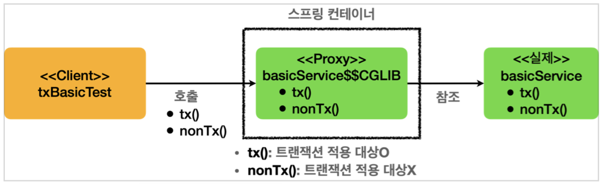

- @Transactional은 스프링에서 트랜잭션을 코드 변경 없이 추상화하기 위해 사용하는 선언적 트랜잭션 처리법.
- 해당 방식을 활용하면 스프링의 트랜잭션 AOP가 적용된다.



- BasicService에 @Transactional 애노테이션이 존재한다면, 스프링은 실제 서비스 객체 대신에 BasicService 객체의 프록시를 생성하여 스프링 컨테이너에 등록한다. 그리고 클라이언트가 BasicService를 요청한다면, 이 프록시를 반환한다.
- 이렇게 함으로서 트랜잭션의 일관성과 안정성을 보장할 수 있다.
- 선언적 트랜잭션과 관련된 코드 리팩토링

    ```java
    @Transactional(readOnly = true)
    static class LevelService {
    
    	@Transactional(readOnly = false)
    	public void write() {
    		...
    	}
    
    	public void read() {
    		...
    	}
    
    	...
    }
    ```

    - 위와 같은 코드가 있다면, Transactional이 중복이 된다. 여기서 스프링은 무언가가 중복될때 더 구체적인 것을 따르기 때문에 클래스보다는 구체적인 메서드의 Transactional을 따르게 된다.
    - 앞으로 코드를 작성할때, 위와 같이 클래스에 먼저 애노테이션을 적용해두고, 메서드에서 옵션만 다르게 하는 코드를 고려해볼 수 있다.
- 프록시 내부 호출에 의해 발생할 수 있는 심각한 문제
    - 프록시 내부 호출
    - 아래의 코드를 참고하자.

    ```java
    static class CallService {
        public void external() {
            log.info("call external");
            printTxInfo();
            internal();
    }
        @Transactional
        public void internal() {
            log.info("call internal");
            printTxInfo();
        }
    ```

    - 위 코드는 프록시 내부 호출에 대한 코드이다.
    - external은 @Transactional이 없는데, 해당 애노테이션을 가지고 있는 internal 메소드를 호출
    - 스프링은 @Transactional 애노테이션이 존재하면 해당 클래스(혹은 메서드?)를 프록시로 만들어서 관리하는데, 이렇게 내부적으로 호출이 되는 경우는 프록시를 통한 관리가 불가능하다.
        - 자바에서 this.internal()로 처리하기 때문이다.
    - 가장 간단한 해결법은, 이런 구조를 피하고 internal 메서드를 별도의 클래스로 분리하는 것이다.
        - 해결법

            ```java
            static class CallService {
                      private final InternalService internalService;
                      public void external() {
                          log.info("call external");
                          printTxInfo();
                          internalService.internal();
            }
                      private void printTxInfo() {
                          boolean txActive =
              TransactionSynchronizationManager.isActualTransactionActive();
                          log.info("tx active={}", txActive);
            } }
                  @Slf4j
                  static class InternalService {
                      @Transactional
                      public void internal() {
                          log.info("call internal");
                          printTxInfo();
                      }
                      private void printTxInfo() {
                          boolean txActive =
              TransactionSynchronizationManager.isActualTransactionActive();
                          log.info("tx active={}", txActive);
            } }
            }
            ```

            - 간단하게 정리하자면, @Transactional이 필요한 메서드는 다른 클래스에 선언해서 의존성을 주입받아 온다. 그렇게 하면 해당 클래스의 프록시를 주입받아서 정상적으로 트랜잭션을 적용할 수 있다.
- 스프링에서 트랜잭션과 관련된 소소한 주의사항
    - 스프링은 @Transactional 애노테이션이 public 메서드에만 적용될 수 있도록 하였다.
    - 따라서 protected나 package-visible 같은 경우는 외부에서 호출이 가능함에도 불구하고 트랜잭션 적용이 되지 않는다.
    - 하지만 스프링에서 public이 아니라고 예외를 발생시키거나 하지는 않기 때문에, 관련 문제가 발생하면 골치 아프다고 한다.
    - 하나 더, 트랜잭션은 @PostContruct 같은 초기화 관련과 엮이면 안된다.
        - 스프링은 초기화 후에 AOP를 호출하기 때문에, 초기화 시점에 트랜잭션을 적용하려고 하면 적용되지 않는다.
- 트랜잭션 롤백 정책
    - 트랜잭션 롤백 기본 정책은 아래와 같다.
    - 언체크 예외인 RunTimeException과 그 하위 예외가 발생하면 롤백한다.
    - 체크 예외인 Exception과 그 하위 예외들은 커밋한다.
    - 트랜잭셔널 애노테이션은 롤백과 관련된 옵션을 제공한다.
        - rollbackFor
            - @Transactional(rollbackFor = Exception.class)
            - 특정 예외가 발생했을 때 롤백하고 싶다면 위와 같이 지정해줄 수 있다.
        - noRollbackFor
            - @Transactional(noRollbackFor = RunTimeException.class)
            - 반대로, 특정 예외가 발생했을 때 롤백하고 싶지 않다면 위와 같이 지정해줄 수 있다.
    - 그럼 대체 왜 체크 예외는 롤백을 하지 않고 언체크 예외는 롤백을 할까?
        - 스프링은 기본적으로 다음과 같이 간주한다.
        - 체크예외는 비즈니스적으로 의미가 있는 예외
            - 이때 왜 롤백을 안하는지는 예시를 들어보면 알 수 있다.
            - 만약 사용자의 계좌 잔고가 부족하면, 사용자에게 잔고 부족이라는 것을 알려야 한다.
            - 그리고 결제 상태를 “대기”로 바꾸고싶다.
            - 이럴때 결제 상태를 바꾸고 (커밋) 사용자에게 알리기 위해서 커밋이 되어야 한다.
        - 언체크예외는 치명적인, 복구 불가능한 예외
        - 이렇게 구분이 되기 때문에 롤백 여부가 나뉘게 된다.
            - 물론 이 관습을 따르지 않아도 된다. rollbackFor, 혹은 noRollbackFor를 활용하면 된다.

- @Transactional readOnly에 대하여
    - 리드온리를 적용하는 가장 큰 이유는, 결국엔 최적화 때문이다.
    - 리드온리 옵션을 부여하면 속도가 향상된다.
    - jpa에서는 변경사항을 반영하는 플러쉬를 호출할 필요가 없기 때문에, 성능이 향상된다.
        - 추가로 데이터의 변경을 감지하기 위해 스냅샷을 생성하는데, 이 경우에는 스냅샷도 생성할 필요가 없어서 성능이 더 좋아진다.
    - jdbc 템플릿에서는 읽기가 아닌 다른 작업이 발생하면 예외를 터뜨린다.
    - 데이터베이스나 드라이버, 환경에 따라 적용되지 않을 수도 있다.
    - 어쨌든 결론은, 리드온리 옵션은 최적화가 발생하기 때문에 적극적으로 활용하는 것이 좋다!


- 트랜잭션 전파
    - 스프링에서 트랜잭션 안에서 다른 트랜잭션이 실행된다면?
        - 스프링은 기본적으로 두개의 트랜잭션을 묶어서 하나의 트랜잭션으로 만들어 준다.
        - 여기서 논리 트랜잭션과 물리 트랜잭션이라는 개념이 등장한다.
        - 물리 트랜잭션
            - 실제로 데이터베이스에 커밋되거나 롤백되는, 실제 트랜잭션 단위
        - 논리 트랜잭션
            - 트랜잭션 매니저를 통해 트랜잭션을 사용할때의 단위이다.
            - 무슨 말인지 아직은 잘 모르겠다.
            - 평소에는 논리 트랜잭션을 고려하지 않고, 이렇게 2개 이상의 트랜잭션을 고려할 때만 논리 트랜잭션에 대해 생각한다.
        - 왜 이렇게 할까?
            - 결론부터 말하자면, 모든 논리 트랜잭션이 커밋되어야 물리 트랜잭션이 커밋된다.
            - 하나의 논리 트랜잭션이라도 롤백된다면, 물리 트랜잭션은 롤백된다.
            - 조금 더 자세히
                - 외부 트랜잭션이 실행 중일 때 내부 트랜잭션 (2번째로 실행된 트랜잭션)이 실행되면, 로그를 확인했을 때 “Participating in existing transaction” 이라는 로그가 있다.
                - 즉 내부 트랜잭션은 외부 트랜잭션으로 “참여”하고, 이후에 내부 트랜잭션이 커밋이 되어도 커밋과 관련된 아무런 로그가 찍히지 않는다. (커밋을 무시함)
                - 스프링은 기본적으로 처음 트랜잭션을 시작한 외부 트랜잭션이 실제 물리 트랜잭션을 관리하게 한다. 이를 통해서 중복 트랜잭션 문제를 해결한다.
                - 원리는 다음과 같다.
                    - 외부 트랜잭션이 호출되면, 트랜잭션 매니저는 데이터소스를 통해 커넥션을 생성하고, 해당 커넥션을 트랜잭션 동기화 매니저에 보관한다. (중략)
                    - 내부 트랜잭션이 호출되면, 트랜잭션 동기화 매니저를 통해 기존 트랜잭션이 존재하는지 확인한다.
                    - 트랜잭션이 존재하면, 기존 트랜잭션에 참여한다. (아무런 행위도 하지 않는다.)
                    - 내부 트랜잭션은 사실 트랜잭션 동기화 매니저에 존재하지 않기 때문에, 커밋을 실행해도 실제 트랜잭션에 커밋이 실행되지 않는다.
                        - 실제 트랜잭션에 커밋이 되어버리면 커넥션이 끊기기 때문에 안된다.
            - 롤백 상황
                - 외부 트랜잭션이 롤백되고, 내부 트랜잭션은 커밋되는 상황
                    - 물리 트랜잭션 자체가 모두 롤백된다.
                    - 외부 트랜잭션(트랜잭션 동기화 매니저에 존재)이 롤백됐기 때문이다.
                - 내부 트랜잭션이 롤백되고, 외부 트랜잭션은 커밋되는 상황
                    - 내부 트랜잭션은 실제 물리 트랜잭션에 관여를 하지 않는다.
                    - 하지만 하나의 논리 트랜잭션이라도 롤백이 일어나면, 물리 트랜잭션은 롤백되어야 한다.
                    - 내부 트랜잭션에서 롤백이 일어나면, 롤백이 일어났다고 트랜잭션 동기화 매니저애 표시한다.
                        - marking existing transaction as rollback-only
                        - “이 트랜잭션은 나 때문에 끝났어, 롤백만 돼야해!”
                    - 이 상태에서 외부 트랜잭션이 커밋되면, 해당 마크에 의해서 전체 트랜잭션이 롤백된다.
                    - 그리고 이 경우 스프링은 예외를 던져준다.
                        - UnexpectedRollbackException 런타임 예외 발생
    - 이게 컨트롤러에서 여러 개의 서비스를 호출 하는 것이 아니라, 한개의 서비스에서 여러 개의 서비스를 호출해야 하는 이유이다.
        - 그렇게 해야 내부 트랜잭션이 실패해도 롤백이 되기 때문이다.
    - 이렇게 하지 않고 트랜잭션을 새로 생성하고 싶다면, REQUIRES_NEW 옵션을 사용하면 된다.
        - 그러면 내부 트랜잭션이 호출될 시 트랜잭션 동기화 매니저에 새로운 db 커넥션을 생성하여
          저장한다.
        - 그리고 이 경우에는 내부 트랜잭션이 커밋되거나 롤백되면 외부 트랜잭션이 수행된다.
        - 하지만 이 방법은 트랜잭션을 분리하기 위해서 데이터베이스 커넥션을 2개 이상 사용하기 때문에, 사용할때 잘 고려해야 한다.