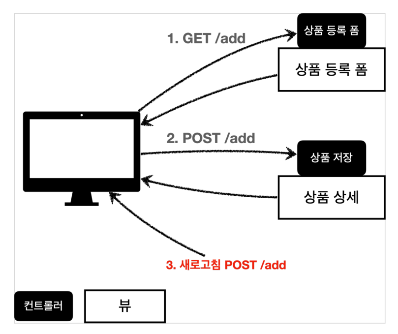
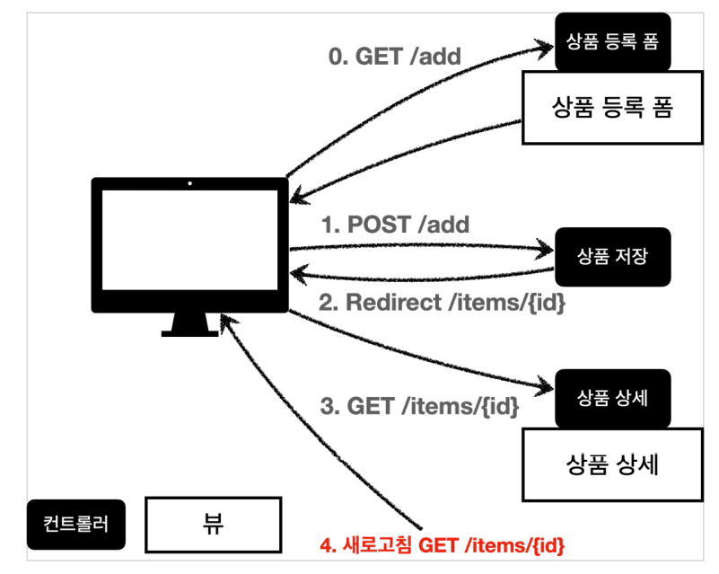

## Mapping

컨트롤러에서, 지정한 URL로 요청이 들어오면 그에 따른 처리를 해주기 위해서  
Mapping 애노테이션을 사용하여 코드를 작성한다.

```java
    @RequestMapping("/hello-basic")
    public String helloBasic() {
        log.info("helloBasic");
        return "ok";
    }
```

@RequestMapping 애노테이션을 이용해서 ..../hello-basic 으로 들어온 요청을 처리할 수 있는  
함수를 만들었다. 위처럼 URL 이외에 아무것도 지정하지 않는다면 모든 메서드에 한해 허용하겠다는
의미이다.
```java
    @RequestMapping(value = "/hello-basic", method = RequestMethod.GET)
    public String helloBasic() {
        log.info("helloBasic");
        return "ok";
    }
```
반대로 value에 URL을 지정하고 method에 특정 HTTP method를 지정해주면, ***해당 메서드로
들어온 요청***만을 처리한다. 즉 위의 코드는 GET 메서드만을 지원한다.

```java
    // 아래와 같이 사용할 Method를 앞글자로 하는 축약 애노테이션도 사용 가능하다.
    /**
     * 편리한 축약 애노테이션 (코드보기)
     * @GetMapping
     * @PostMapping
     * @PutMapping
     * @DeleteMapping
     * @PatchMapping
     */
    @GetMapping(value = "/mapping-get-v2")
    public String mappingGetV2() {
        log.info("mapping-get-v2");
        return "ok";
    }
```
또한 @RequestMapping + HTTP method 지정 방식이 아니라, 위와 같이 메서드 이름을
서두에 붙여서 지원할 메서드를 정할 수 있다. 위의 경우는 GetMapping이므로 GET메서드를
지원하겠다는 의미이다.
```java
    /**
     * PathVariable 사용
     * 변수명이 같으면 생략 가능
     * @PathVariable("userId") String userId -> @PathVariable userId
     */
    // URL에서 붙어서 들어온 데이터를 빼서 사용하기 위해 PathVariable 애노테이션을 사용한다.
    @GetMapping("/mapping/{userId}")
    public String mappingPath(@PathVariable("userId") String data) {
        log.info("mappingPath userId={}", data);
        return "ok";
    }

    // 아래와 같이 PathVariable에 문자열을 건네주지 않고 userId로 변수명을 일치시켜도 동일하게 사용 가능하다.
    //    @GetMapping("/mapping/{userId}")
    //    public String mappingPath(@PathVariable String userId) {
    //        log.info("mappingPath userId={}", userId);
    //        return "ok";
    //    }


    // 아래처럼 다중으로 PathVariable을 사용할 수도 있다.
    @GetMapping("/mapping/{userId}/orders/{orderId}")
    public String mappingPath(@PathVariable String userId, @PathVariable Long orderId) {
        log.info("mappingPath userId={}, orderId={}", userId, orderId);
        return "ok";
    }
```
위는 PathVariable에 관한 코드로, URL에 첨부되어 전달된 값을 변수로 저장하여
활용할 수 있게 해준다. 예제에서는 userId, orderId를 추출하여 로그로 출력한다.
```java
    /**
     * Content-Type 헤더 기반 추가 매핑 Media Type
     * consumes="application/json"
     * consumes="!application/json"
     * consumes="application/*"
     * consumes="*\/*"
     * MediaType.APPLICATION_JSON_VALUE
     */
    // consume은 미디어 타입 조건 매핑에 사용된다.
    // 들어온 요청의 헤더 중 Content-Type 필드의 값이 "application/json"이어야 응답을 보낸다.
    // consume : content-type을 의미, 서버입장에서 보면 요청의 content type을 소비하는 것이기 때문에 consume이라고 한다고 함.
    //    @PostMapping(value="/mapping-consume", consumes = "application/json")
    @PostMapping(value="/mapping-consume", consumes = MediaType.APPLICATION_JSON_VALUE)
    public String mappingConsumes() {
        log.info("mappingConsumes");
        return "ok";
    }
```
들어온 요청의 헤더를 보고, 미디어 타입이 JSON인 요청에만 반응하고 싶다면
consumes 옵션을 사용해야 한다.

```java
    /**
     * Accept 헤더 기반 Media Type
     * produces = "text/html"
     * produces = "!text/html"
     * produces = "text/*"
     * produces = "*\/*"
     */
    // produce는 클라이언트가 "나는 content 타입이 text/html인걸 받아들일 수 있어!" 라는 의미라고 한다.
    // 보내는 요청의 헤더 중 Accept 필드가 "text/html"이어야만 응답을 보낸다.
    //    @PostMapping(value = "/mapping-produce", produces = "text/html")
    @PostMapping(value = "/mapping-produce", produces = MediaType.TEXT_HTML_VALUE)
    public String mappingProduces() {
        log.info("mappingProduces");
        return "ok";
    }
```
비슷하게 클라이언트가 보낸 요청의 헤더 중 Accept 필드 (클라이언트가 받고싶어하는 데이터타입)
가 특정 미디어 타입이어야만 처리하고 싶다면 위처럼 produces 옵션을 사용해야 한다.

***

## Controller

여러가지 매핑들을 관리하는 컨트롤러는 대략적으로 다음과 같이 구성된다.

```java
    package hello.springmvc.basic.requestmapping;


    import org.springframework.web.bind.annotation.*;

    @RestController
    // 아래의 Mapping들은 모두 /mapping/users를 포함하기 때문에 클래스 단위에서 한번에 묶는다.
    @RequestMapping("/mapping/users")
    public class MappingClassController {

        @GetMapping
        public String users() {
            return "get users";
        }

        @PostMapping
        public String addUser() {
            return "post user";
        }


        @GetMapping("/{userId}")
        public String findUser(@PathVariable String userId) {
            return "get userId=" + userId;
        }

        @PatchMapping("/{userId}")
        public String updateUser(@PathVariable String userId) {
            return "update userId=" + userId;
        }

        @DeleteMapping("/{userId}")
        public String deleteUser(@PathVariable String userId) {
            return "delete userId=" + userId;
        }
    }
```
여기서 핵심은 중복되는 URL에 대해서 클래스 상단에 @RequestMapping 애노테이션을 둬서
묶어버리는 것이다.

***

## Header

```java
    @Slf4j
    @RestController
    public class RequestHeaderController {

        @RequestMapping("/headers")
        public String headers(HttpServletRequest request,
                          HttpServletRequest response,
                          HttpMethod httpMethod,
                          Locale locale,
                          @RequestHeader MultiValueMap<String, String> headerMap,
                          @RequestHeader("host") String host,
                          @CookieValue(value = "myCookie", required = false)String cookie) {
            log.info("request={}", request);
            log.info("response={}", response);
            log.info("httpMethod={}", httpMethod);
            log.info("locale={}", locale);
            log.info("headerMap={}", headerMap);
            log.info("header host={}", host);
            log.info("myCookie={}", cookie);
            return "ok";
        }
    }
```
위 함수의 실행결과 로그는 다음과 같다.

    request=org.apache.catalina.connector.RequestFacade@35f80553
    response=org.apache.catalina.connector.RequestFacade@35f80553
    httpMethod=GET
    locale=ko_KR
    headerMap={user-agent=[PostmanRuntime/7.29.2], accept=[*/*], postman-token=[4d204699-bffa-4f50-85c4-b859674e3b27], host=[localhost:8080], accept-encoding=[gzip, deflate, br], connection=[keep-alive]}
    header host=localhost:8080
    myCookie=null

@RequestHeader MultiValueMap<String, String> headerMap 매개변수의 경우는
헤더 정보를 모두 가져오기 위한 것이다. 같은 키에 여러개의 value가 있을때도 사용할 수
있는 방법이라 유용하다.
MultiValueMap의 특징 :
+ MAP과 유사한데, 하나의 키에 여러 값을 받을 수 있다
+ HTTP header, HTTP 쿼리 파라미터와 같이 하나의 키에 여러 값을 받을 때 사용한다
    + ***keyA=value1&keyA=value2***

또한 @RequestHeader("host") String host 매개변수를 이용해서 필수 헤더값인 host만
볼수도 있다.

***

## HTTP request parameter

요청에 붙어서 넘어온 Parameter를 다룬다.

클라이언트에서 서버로 요청 데이터를 전달할 때는 주로 다음 3가지 방법을 사용한다.

+ GET - 쿼리 파라미터
    + /...url...?username=hello&age=20
    + 메시지 바디 없이, URL의 쿼리 파라미터에 데이터를 포함해서 전달
    + 검색, 필터, 페이징등에서 많이 사용하는 방식
+ Post - HTML Form
    + content-type: application/x-www-form-urlencoded
    + ***메시지 바디***에 쿼리 파리미터 형식으로 전달 username=hello&age=20
    + 예) 회원 가입, 상품 주문, HTML Form 사용
+ HTTP message body에 데이터를 직접 담아서 요청
    + REST API(HTTP API)에서 주로 사용, JSON, XML, TEXT
    + 데이터 형식은 주로 JSON
    + POST, PUT, PATCH

***GET방식과 POST방식의 차이점은 메시지 바디의 유무.***


GET 방식이나 POST 방식을 이용해서 넘어온 매개변수를 저장하는 방법으로는  
@RequestParam, @ModelAttribute가 있다.

HTTP message body의 데이터를 읽어오는 방법은 @RequestBody가 있다.

***이 3가지를 사용하는 경우와 상황을 알고있어야 개발을 시작할 수 있을 것 같다.***

```java
     // @RequestParam을 이용하지 않은 방법. v1
    @RequestMapping("/request-param-v1")
    public void requestParamV1(HttpServletRequest request, HttpServletResponse response) throws IOException {
        String username = request.getParameter("username");
        int age = Integer.parseInt(request.getParameter("age"));
        log.info("username={}, age={}", username, age);

        response.getWriter().write("ok");
    }
```
@RequestParam을 쓰지 않으면 위와 같은 코드로 parameter를 다룰 수 있다.

### RequestParam
```java
    @ResponseBody
    @RequestMapping("/request-param-v2")
    public String requestParamV2(
            @RequestParam("username") String memberName,
            @RequestParam("age") int memberAge) {
        log.info("username={}, age={}", memberName, memberAge);
        // 여기서 클래스 상단의 애노테이션이 @RestController가 아니라 @Controller기때문에 문자열을 반환하면
        // viewResolver가 view를 찾게된다. 이것을 방지하기 위해 @ResponseBody를 사용하는데,
        // 해당 애노테이션을 이용하면 viewResolver를 호출하지 않고 바로 body에 문자열을 집어넣게 된다.
        return "ok";
    }
```
RequestParam 애노테이션을 활용하면 위처럼 간단하게 parameter를 추출할 수 있다.
또한 PathVariable 처럼 변수명과 parameter 명이 일치한다면 이름 지정을 생략할 수 있다.

```java
    @ResponseBody
    @RequestMapping("/request-param-v3")
    public String requestParamV3(@RequestParam String username, @RequestParam int age) {
        log.info("username={}, age={}", username, age);
        // 여기서 클래스 상단의 애노테이션이 @RestController가 아니라 @Controller기때문에 문자열을 반환하면
        // viewResolver가 view를 찾게된다. 이것을 방지하기 위해 @ResponseBody를 사용하는데,
        // 해당 애노테이션을 이용하면 viewResolver를 호출하지 않고 바로 body에 문자열을 집어넣게 된다.
        return "ok";
    }
```
조금 더 극단적으로, 변수 타입이 String, int, Integer같은 기본형이라면 애노테이션
자체도 생략할 수 있다.

```java
    @ResponseBody
    @RequestMapping("/request-param-v4")
    public String requestParamV4(String username, int age) {
        log.info("username={}, age={}", username, age);
        // 여기서 클래스 상단의 애노테이션이 @RestController가 아니라 @Controller기때문에 문자열을 반환하면
        // viewResolver가 view를 찾게된다. 이것을 방지하기 위해 @ResponseBody를 사용하는데,
        // 해당 애노테이션을 이용하면 viewResolver를 호출하지 않고 바로 body에 문자열을 집어넣게 된다.
        return "ok";
    }
```
하지만 애노테이션을 생략하면 오히려 가독성이 안좋아져서 이렇게 까지 줄이는건 권장하지 않는다고
한다.


### Required

```java
     @ResponseBody
    @RequestMapping("/request-param-required")
    public String requestParamRequired(
            @RequestParam(required = true) String username,
            @RequestParam(required = false) Integer age) {

        log.info("username={}, age={}", username, age);
        return "ok";
    }
```
필수 parameter를 건네받아야 한다면 required 옵션을 사용한다.  
옵션을 지정하지 않는다면 default로 required = true가 지정된다.  
추가로 필수 parameter가 아닌 경우엔 해당 매개변수가 전달되지 않으면 null이 들어가는데,
int와 같은 타입으로 선언된 경우에는 null이 들어가면 response 500 오류가 발생한다.  
따라서 Integer 등의 타입으로 선언해야 오류가 발생하지 않는다.

```java
    @ResponseBody
    @RequestMapping("/request-param-default")
    public String requestParamDefault(
            @RequestParam(required = true, defaultValue = "guest") String username,
            @RequestParam(required = false, defaultValue = "-1") int age) {

        log.info("username={}, age={}", username, age);
        return "ok";
    }
```
defaultValue는 parameter가 전달되지 않았을때 들어가는 값으로, null대신 해당 값을 넣어서
처리해주겠다는 의미이다. 이것을 활용하면 int와 같은 타입도 오류 없이 사용할 수 있다.  
추가로 defaultValue를 사용하면 ***사실상 required 옵션이 필요가 없다.***

```java
    @ResponseBody
    @RequestMapping("/request-param-map")
    public String requestParamMap(@RequestParam Map<String ,Object> paramMap) {
        log.info("username={}, age={}", paramMap.get("username"), paramMap.get("age"));
        return "ok";
    }
```
Map을 활용해서 parameter 전체를 받아볼 수 있다.  
후에 paramMap.get("username")과 같이 꺼내올 수 있다.


### @ModelAttribute

parameter로 넘어온 변수를 객체에 저장해주려면 어떻게 해야할까.  
아래의 방법은 정석적인 구식 방법이다.
 ```java
    @ResponseBody
    @RequestMapping("/model-attribute-v1")
    public String modelAttributeV1(@RequestParam String username, @RequestParam int age) {
        HelloData helloData = new HelloData();
        helloData.setUsername(username);
        helloData.setAge(age);

        return "ok";
    }
```
직접 객체에 setter로 데이터를 넣어주는 방법이다.  
하지만 스프링에서는 @ModelAttribute 애노테이션을 활용하여 이를 자동화 할 수 있다.

```java
    @ResponseBody
    @RequestMapping("/model-attribute-v1")
    public String modelAttributeV1(@ModelAttribute HelloData helloData) {
        log.info("username={}, age={}", helloData.getUsername(), helloData.getAge());
        return "ok";
    }
```
다음과 같은 과정이 스프링 내부에서 일어나며 객체가 저장된다 :

+ HelloData 객체를 생성한다.
+ 요청 파라미터의 이름으로 HelloData객체의 프로퍼티를 찾는다.  
  그리고 해당 프로퍼티의 Setter를 호출해서 파라미터의 값을 바인딩한다.
+ ex) 파라미터의 이름이 username이면 setUsername() 메서드를 찾아서 값을 입력한다.

#### 프로퍼티
+ 객체에 getUsername() , setUsername() 메서드가 있으면,  
  이 객체는 username 이라는 프로퍼티를 가지고 있다.  
  username 프로퍼티의 값을 변경하면 setUsername() 이 호출되고,   
  조회하면 getUsername() 이 호출된다.

추가로 age=abc 와 같이 변수 타입이 일치하지 않으면 바인딩 예외가 발생한다.

```java
    /**
     * @ModelAttribute 생략 가능
     * String, int와 같은 단순 타입 = @RequestParam
     * 그 외 타입 (argument resolver로 지정한 타입 이외) = @ModelAttribute
     */
    @ResponseBody
    @RequestMapping("/model-attribute-v2")
    public String modelAttributeV2(HelloData helloData) {
        log.info("username={}, age={}", helloData.getUsername(), helloData.getAge());
        return "ok";
    }
```
@ModelAttribute도 @RequestParam과 같이 생략할 수 있다.  
다만 스프링은 내부적으로 이 생략된 부분에 대해 단순 타입이라면 @RequestParam이라고
단정지어버린다. 자세한 내용은 상단의 주석 확인.

***

## HTTP body

요청의 body에 담긴 데이터를 조회하는 여러가지 방법에 대해 기술하겠다.

```java
    // v1 : request와 response를 객체로 두고 그 객체 안에서 inputStream -> messageBody 순으로 받아오는 방법
    @PostMapping("request-body-string-v1")
    public void requestBodyString(HttpServletRequest request, HttpServletResponse response) throws IOException {
        ServletInputStream inputStream = request.getInputStream();
        String messageBody = StreamUtils.copyToString(inputStream, StandardCharsets.UTF_8);

        log.info("messageBody={}", messageBody);

        response.getWriter().write("ok");
    }
```
request와 response 객체를 받고, request 객체의 InputStream을 받아서 body 정보를 받고,
응답을 보낼때도 response 객체의 writer를 이용해서 응답 body에 데이터를 넣는 형식.  
구식이고 상당히 복잡하다.

```java
    // v2 : 그냥 input, output stream만 넘기면 받아올 수 있음
    @PostMapping("request-body-string-v2")
    public void requestBodyStringV2(InputStream inputStream, Writer responseWriter) throws IOException {
        String messageBody = StreamUtils.copyToString(inputStream, StandardCharsets.UTF_8);
        log.info("messageBody={}", messageBody);

        responseWriter.write("ok");
    }
```
request, response 객체를 받지 않고 InputStream과 Writer만 받으면 위와 똑같은
기능을 구현할 수 있다.

```java
    // v3 : HttpEntity를 활용하면 input, output stream은 물론이고 request, response 객체를 받을 필요가 없다.
    @PostMapping("request-body-string-v3")
    public HttpEntity<String> requestBodyStringV3(HttpEntity<String> httpEntity) throws IOException {
        String messageBody = httpEntity.getBody();
        // HttpHeaders headers = httpEntity.getHeaders();
        // 헤더 정보도 얻을 수 있음
        log.info("messageBody={}", messageBody);

        // HttpEntity를 사용하게 되면 view를 조회하지 않는다.
        return new HttpEntity<>("ok");
    }
```
HttpEntity는 요청 및 응답의 body와 header 정보를 담고있는 객체로, 이것을 이용해서
body나 header를 처리할 수 있다.

```java
    // v4 : @RequestBody 애노테이션을 통해 body를 바로 불러올 수 있다.
    // 반환은 여태 써온 @ResponseBody 애노테이션으로 응답의 body에 데이터를 넣어줄 수 있다.
    @ResponseBody
    @PostMapping("request-body-string-v4")
    public String requestBodyStringV4(@RequestBody String messageBody) {
        log.info("messageBody={}", messageBody);
        return "ok";
    }
```
현업에서 가장 많이 사용하고, 권장하는 방법이다.  
@RequestBody 애노테이션을 명시해서 body 데이터를 지정한 타입으로 받는다.  
반환도 마찬가지로 @ResponseBody 애노테이션을 명시해서 response의 body에 반환 데이터를
콕 집어서 넣어준다.

참고로 헤더 정보가 필요하다면 @RequestHeader를 사용하면 동일하게 정보를 얻을 수 있다.


### Http body JSON

HTTP Body에 들어있는 JSON 형식의 데이터는 어떻게 처리될지 기술하겠다.

```java
    @PostMapping("/request-body-json-v1")
    public void requestBodyJsonV1(HttpServletRequest request, HttpServletResponse response) throws IOException {
        ServletInputStream inputStream = request.getInputStream();
        String messageBody = StreamUtils.copyToString(inputStream, StandardCharsets.UTF_8);

        log.info("messageBody={}", messageBody);
        HelloData helloData = objectMapper.readValue(messageBody, HelloData.class);
        log.info("username={}, age={}", helloData.getUsername(), helloData.getAge());

        response.getWriter().write("ok");
    }
```
String과 동일하게 request, response 객체를 받고 InputStream과 Writer를 이용해서
body의 JSON 데이터를 추출할 수 있고, 추가적으로 ObjectMapper를 이용해서 JSON 데이터를
객체로 변환하는 방법이다. 마찬가지로 구식이고 복잡하다.

```java
    @ResponseBody
    @PostMapping("/request-body-json-v2")
    public String requestBodyJsonV2(@RequestBody String messageBody) throws IOException {

        log.info("messageBody={}", messageBody);
        HelloData helloData = objectMapper.readValue(messageBody, HelloData.class);
        log.info("username={}, age={}", helloData.getUsername(), helloData.getAge());

        return "ok";
    }
```
@RequestBody로 body를 읽어오는 과정을 단축시킨 형태이다.  
더 편해지긴 했지만 ObjectMapper를 써서 수동으로 객체로 변환하는 것은 변치않았다.

```java
    // @RequestBody 뒤에 객체 타입을 명시해줌으로서 바디에 있는 JSON 데이터를 바로 객체로 저장할 수 있다.
    // 하지만 이 경우 @RequestBody 애노테이션을 절대로 생략해선 안된다.
    // 생략할 경우 @ModelAttribute가 호출되기 때문이다.
    @ResponseBody
    @PostMapping("/request-body-json-v3")
    public String requestBodyJsonV3(@RequestBody HelloData helloData) {
        log.info("username={}, age={}", helloData.getUsername(), helloData.getAge());
        return "ok";
    }
```
@RequestBody 뒤에 객체 타입을 명시함으로서 자동으로 객체로 변환되게 만들었다.  
여기서 ***중요한 점은, @RequestBody 애노테이션을 생략하면 안된다.*** 주석 참고

```java
    @ResponseBody
    @PostMapping("/request-body-json-v4")
    public String requestBodyJsonV4(HttpEntity<HelloData> httpEntity) {
        HelloData helloData = httpEntity.getBody();
        log.info("username={}, age={}", helloData.getUsername(), helloData.getAge());
        return "ok";
    }
```
HttpEntity를 활용해서도 구현이 가능하다.

```java
    // @ResponseBody가 있으면 반환타입도 HelloData로 설정할 수 있다.
    // HTTP Message Converter로 인해서 JSON으로 바껴서 응답의 body에 삽입된다.
    @ResponseBody
    @PostMapping("/request-body-json-v5")
    public HelloData requestBodyJsonV5(@RequestBody HelloData helloData) {
        log.info("username={}, age={}", helloData.getUsername(), helloData.getAge());
        return helloData;
    }
```
응답의 경우에도 @ResponseBody 를 사용하면 해당 객체를 HTTP 메시지 바디에 직접 넣어줄 수 있다.
물론 이 경우에도 HttpEntity 를 사용해도 된다.

+ RequestBody 요청
    + JSON 요청 -> HTTP 메시지 컨버터 -> 객체

+ ResponseBody 응답
    + 객체 -> HTTP 메시지 컨버터 -> JSON 응답

***

## static, templates

### 정적 리소스

resources/static 디렉토리의 하위에는 정적 리소스가 들어간다.  
정적 리소스는 ***해당 파일을 변경 없이 그대로 서비스하는 것을 의미한다.***

### 뷰 템플릿

뷰 템플릿을 거쳐서 HTML이 생성되고, 뷰가 응답을 만들어서 전달한다.  
일반적으로 HTML을 동적으로 생성하는데 이용되지만, 이 기능 뿐만 아니라
뷰 템플릿이 만들 수 있는 것이라면 뭐든지 가능하다.

아래는 HTML의 data에 뷰 템플릿을 이용하여 동적으로 데이터를 집어넣는 코드들이다.

```java
    @RequestMapping("/response-view-v1")
    public ModelAndView responseViewV1(){
        ModelAndView modelAndView = new ModelAndView("response/hello")
                .addObject("data", "hello!");
        return modelAndView;
    }
```
ModelAndView를 선언하여 직접 "data"라는 이름을 가진 attribute에 "hello!"라는
값을 넣어주는 방식이다.

```java
    @RequestMapping("/response-view-v2")
    public String responseViewV2(Model model) {
        model.addAttribute("data", "hello!");
        return "response/hello";
    }
```
@Controller 애노테이션이 달려있다면, 문자열로 View의 논리주소를 반환하는걸로
View Resolver를 통해 view를 랜더링할 수 있다. 따라서 ModelAndView가 아니라
Model만 있으면 view를 랜더링할 수 있다.

```java
    @RequestMapping("/response/hello")
    public void responseViewV3(Model model) {
        model.addAttribute("data", "hello!");
    }
```
권장하지는 않지만 위의 방법도 존재한다.  
매핑 주소가 view의 로직 주소와 일치한다면 반환값이 없어도 위처럼 랜더링을 할 수 있다.


### ResponseBodyController

다시 한번 코드로 응답의 body에 데이터를 넣어서 반환하는 방법에 대해 알아보겠다.

```java
    @Slf4j
    //@Controller
    //@ResponseBody
    // 하단의 코드를 보면 @ResponseBody 애노테이션이 적용된 것도 있고 적용되지 않은 것도 있다
    // 그럴 경우 이렇게 클래스 레벨에서 @ResponseBody 애노테이션을 달아주면 아래에 모두 적용이 된다.
    // 그리고 이렇게 @Controller와 @ResponseBody를 합친 것이 @RestController 이다.
    @RestController
    public class ResponseBodyController {

       @GetMapping("/response-body-string-v1")
        public void responseBodyV1(HttpServletResponse response) throws IOException {
            response.getWriter().write("ok");
       }
    
        @GetMapping("/response-body-string-v2")
       public ResponseEntity<String> responseBodyV2() {
            return new ResponseEntity<>("ok", HttpStatus.OK);
       }
    
        // 여기까지는 String 타입의 response body
       ///////////////////////////////////////////////////////////////////
       // 여기서부터는 JSON 타입의 response body

       @ResponseBody
       @GetMapping("/response-body-string-v3")
       public String responseBodyV3() {
           return "ok";
       }

       @GetMapping("/response-body-json-v1")
       public ResponseEntity<HelloData> responseBodyJsonV1() {
            HelloData helloData = new HelloData();
            helloData.setUsername("userA");
            helloData.setAge(20);
            return new ResponseEntity<>(helloData, HttpStatus.OK);
       }


        // 이렇게 @ResponseBody를 활용해서 객체를 바로 반환하는 경우는 HttpStatus를 지정할 수 없다.
        // 이 경우 @ResponseStatus를 활용해서 HttpStatus를 지정하도록 한다.
        @ResponseStatus(HttpStatus.OK)
        @ResponseBody
        @GetMapping("/response-body-json-v2")
       public HelloData responseBodyJsonV2() {
           HelloData helloData = new HelloData();
           helloData.setUsername("userA");
           helloData.setAge(20);
           return helloData;
        }
    }
```
다른 내용은 위에서 다 살펴본 것들이고, 주목할 점은 클래스 단위에서 @ResponseBody를
묶어서 사용한 것과, @ResponseBody와 @Controller를 합친 것이 @RestController
애노테이션이고, 현업에서 이 방식을 많이 사용한다는 것이다.

***

## HTTP 메시지 컨버터

***@ResponseBody, @RequestBody || HttpEntity(RequestEntity, ResponseEntity)***

위 기능들을 사용할때 요청이나 응답에 데이터를 처리하는데, JSON이나 text로 온 데이터를
누군가 변환해서 선언해둔 변수에 넣어준다.  
여기서 그 누군가가 ***HTTP 메시지 컨버터***이다.

주요 컨버터는 다음과 같다.

+ ByteArrayHttpMessageConverter : byte[] 데이터를 처리한다
    + 클래스 타입: byte[] , 미디어타입: \*/*
    + 요청 예) @RequestBody byte[] data
    + 응답 예) @ResponseBody return byte[] 쓰기 미디어타입 application/octet-stream
+ StringHttpMessageConverter : String 문자로 데이터를 처리한다
    + 클래스 타입: String , 미디어타입: \*/*
    + 요청 예) @RequestBody String data
    + 응답 예) @ResponseBody return "ok" 쓰기 미디어타입 text/plain
+ MappingJackson2HttpMessageConverter : application/json
    + 클래스 타입: 객체 또는 HashMap , 미디어타입 application/json 관련
    + 요청 예) @RequestBody HelloData data
    + 응답 예) @ResponseBody return helloData 쓰기 미디어타입 application/json 관련

더 자세히 코드로 예시를 보면 다음과 같다.

### StringHttpMessageConverter

    content-type: application/json
    @RequestMapping
    void hello(@RequetsBody String data) {}

클래스타입이 String이고 미디어타입이 application/json이니
StringHttpMessageConverter가 매칭된다.

### MappingJackson2HttpMessageConverter

    content-type: application/json
    @RequestMapping
    void hello(@RequetsBody HelloData data) {}

같은 원리로 위 코드는 MappingJackson2HttpMessageConverter와 매핑된다.

    content-type: text/html
    @RequestMapping
    void hello(@RequetsBody HelloData data) {}

하지만 위 코드는 어떤 메시지 컨버터와도 매칭되지 않는다. 클래스 타입이 객체인데,
미디어 타입이 application/json이 아닌 text/html이기 때문이다.

그렇다면 이 HTTP 메시지 컨버터는 어디서 사용되는 걸까?

### ArgumentResolver, ReturnValueHandler


우리가 @RequestMapping을 통해서 요청을 처리할때, 굉장히 다양한 parameter를 받을
수 있었다. @RequestBody, @PathVariable, HttpEntity, String ...  
이렇게 다양하고 유연한 매개변수를 전달하는 것이 가능한 이유가 ArgumentResolver라는  
인터페이스 덕분이다. ArgumentResolver는 많은 (약 30개) 구현체를 가지고있고,
스프링은 각 구현체를 순회하면서 매개변수를 처리할 수 있는지 확인한다.

마찬가지로 ReturnValue 또한 void, String, HttpEntity(ResponseEntity) ...  
굉장히 다양한데, 이것도 ReturnValueHandler 라는 인터페이스를 통해 가능하다.

***HTTP 메시지 컨버터는 이 두가지에서 사용된다.***


스프링은 ArgumentResolver, ReturnValueHandler, HttpMessageConverter를 모두
인터페이스로 제공한다. 따라서 필요하다면 직접 구현체를 만들어 확장할 수 있다.  
당장은 중요하지 않고, 추후에 만약 필요하다면 WebMvcConfigurer를 검색하라고 한다.


***

## Thyme leaf

    <html xmlns:th="http://www.thymeleaf.org">

+ "th"로 타임리프 템플릿을 사용할 수 있게 선언


    <!DOCTYPE HTML>
    <html xmlns:th="http://www.thymeleaf.org">
    <head>
      <meta charset="utf-8">
      <link   th:href="@{/css/bootstrap.min.css}"
              href="../css/bootstrap.min.css" rel="stylesheet">
    </head>

+  th:href="@{/css/bootstrap.min.css}" 는 타임리프 엔진으로 특정 css의
   사용 경로를 지정하는 것이다.
    + 이렇게 하는 이유는 동적인 페이지인 template을 쓰게 되면 정적 페이지의 ../ 경로와
      문제가 생겨서 인 것으로 추정된다.


    <div class="row">
      <div class="col">
        <button class="btn btn-primary float-end"
                onclick="location.href='addForm.html'"
                th:onclick="|location.href='@{/basic/items/add}'|"
                type="button">상품
          등록</button>
      </div>
    </div>

"상품 등록" 버튼을 눌렀을 때 기존 html에서 타임리프 엔진으로 변경한 코드이다.  
***th:onclick="|location.href='@{/basic/items/add}'|"***  
여기서 사용된 문법은 다음과 같다.
+ ||
+ @{ ...location... }


또한 thyme leaf를 이용해서 동적으로 list 형태의 데이터를 반복문으로 순회하며
꺼낼 수 있다.

아래의 코드는 정적인 순수 html이다.

     <tr>
        <td><a href="item.html">1</a></td>
        <td><a href="item.html">테스트 상품1</a></td>
        <td>10000</td>
        <td>10</td>
      </tr>
      <tr>
        <td><a href="item.html">2</a></td>
        <td><a href="item.html">테스트 상품2</a></td>
        <td>20000</td>
        <td>20</td>
      </tr>

해당 코드는 다음과 같이 수정할 수 있다.

    <tr th:each="item : ${items}">
                <td><a href="item.html" th:href="@{/basic/items/{itemId}(itemId=${item.id})}" th:text="${item.id}">회원ID</a></td>
                <td><a href="item.html" th:href="@{/basic/items/{itemId}(itemId=${item.id})}" th:text="${item.itemName}">상품명</a></td>
                <td th:text="${item.price}">10000</td>
                <td th:text="${item.quantity}">10</td>
      </tr>

몇가지 문법을 살펴보자면,  
***th:each="item : ${items}"은 반복문이다.*** 순수 html이라면 리스트의 수 만큼 직접 \<tr>\</tr>로 감싸줘야했다.
타임리프를 이용해서 하나의 tr 안에서 반복문으로 모두 해결할 수 있다.

또한 ***a href="item.html"*** 코드를 통해서 item.html 페이지를 로드해두고,  
뒤에 따라오는 ***th:href="@{/basic/items/{itemId}(itemId=${item.id})}"***
코드에서 상품을 클릭하면 /basic/items/(itemId) 페이지를 로드하는데, itemId는
***itemId=${item.id}*** 코드를 통해 각 아이템마다 고유한 아이디가 할당된다.

또한 뒤에서 다루겠지만, 리터럴 대체 (||) 를 이용하면 th:href를 다음과 같이  
더 편리하게 사용할 수 있다.

    th:href="@{|/basic/items/${item.id}|}"


타임리프가 좋은 점은, html과 양립하여 사용할 수 있다는 것이다.  
html입장에서는 모르는 문법(th)이 나오면 무시해버리고 본래의 화면을 띄운다.

***

## 타임리프 문법 정리

위의 예제를 토대로 타임리프 문법 중 일부를 살펴보겠다!

### 타임리프 사용 선언

> < html xmlns:th="http://www.thymeleaf.org" >

### 속성 변경 - th:href

>th:href="@{/css/bootstrap.min.css}"
> + href="value1"을 th:href="value2"의 값으로 변경한다.
> + HTML을 그대로 볼 때는 href 속성이 사용되고, 뷰 템플릿을 거치면 th:href 의 값이 href 로
    대체되면서 동적으로 변경할 수 있다
> + 대부분의 HTML 속성을 th:xxx로 변경할 수 있다고 한다.

### URL링크 표현식 - @{...}
> + th:href="@{/css/bootstrap.min.css}"
> + @{...} : 타임리프는 URL 링크를 사용하는 경우 @{...} 를 사용한다. 이것을 URL 링크 표현식이라 한다

### 속성 변경 - th:onclick
> + onclick="location.href='addForm.html'"
> + ####th:onclick="|location.href='@{/basic/items/add}'|"

위에서 알아보았듯 기존 HTML의 onclick을 th:onclick으로 대체함.  
여기서 리터럴 대체(||)가 사용되었는데, 이것에 대해서 알아보겠다.

### 리터럴 대체 - |...|
> + 타임리프에서 문자와 표현식 등은 분리되어 있기 때문에 더해서
    > 사용해야 한다.
> + < span th:text="'Welcome to our application, ' + ${user.name} + '!'" >  
    > 이를 리터럴 대체를 이용하면 아래왁 같이 편리하게 사용할 수 있다.
> + < span th:text="|Welcome to our application, ${user.name}!|" >
>
> location.href='/basic/items/add' 와 같은 결과를 만들고 싶다면,  
> th:onclick="'location.href=' + '\'' + @{/basic/items/add} + '\''"와 같이
> 나타내야 하겠지만, 리터럴 대체를 활용해서 다음과 같이 나타낼 수 있도록 하자.
> > th:onclick="|location.href='@{/basic/items/add}'|"


### 반복 출력 - th:each
> ####< tr th:each="item : ${items}" >
> + 반복은 th:each 를 사용한다. 이렇게 하면 모델에 포함된 items 컬렉션 데이터가 item 변수에 하나씩
    포함되고, 반복문 안에서 item 변수를 사용할 수 있다.
> + 컬렉션의 수 만큼 <tr>..</tr> 이 하위 테그를 포함해서 생성된다.

### 변수 표현식 - ${...}
> ####< td th:text="${item.price}" >10000</ td>
> 모델에 포함된 값이나, 타임리프 변수로 선언한 값을 조회할 수 있다.


### 내용 변경 - th:text
> ####< td th:text="${item.price}" >10000</ td>
> 내용의 값을 th:text의 값으로 변경한다.  
> 위 예제에서는 10000의 값을 item.price로 변경한다.


### URL 링크 표현식 - 변수 표현식 + 리터럴 대체
> ####th:href="@{/basic/items/{itemId}(itemId=${item.id})}"
> 위 코드는 item.id를 동적으로 변수에서 얻어온 뒤 URL로 구성시켜주는 코드이다.
>> itemId는 경로변수 뿐만 아니라 쿼리 파라미터도 생산한다.
>> + th:href="@{/basic/items/{itemId}(itemId=${item.id},
     query='test')}"
>> + 생성 링크: http://localhost:8080/basic/items/1?query=test
>
> 리터럴 대체를 활용하면 이를 더 쉽게 표현할 수 있다.
> ### th:href="@{|/basic/items/${item.id}|}"

***

## th:action

    @GetMapping("/{itemId}")
    public String item(@PathVariable long itemId, Model model) {
        Item item = itemRepository.findById(itemId);
        model.addAttribute("item", item);
        return "basic/item";
    }

    @GetMapping("/add")
    public String addForm(){
        return "basic/addForm";
    }

    //<form action="item.html" th:action="/basic/items/add" method="post">
    // 기존 item.html을 렌더링하는 것에 th:action="/basic/items/add" 코드를 이용해서 치환하였다.
    // 중요한 점은 th:action 뒤의 URL과 item.html이 렌더링되는 URL이 같다는 것인데, 메서드만 Get에서 Post로 달라진다.
    // 그 점을 이용해서 이렇게 addForm과 url은 같지만 다른 기능을 하는 save 함수를 만들 수 있다.
    // 참고로 <form action="item.html" th:action method="post">와 같이 action뒤의 url을 비워둬도 된다.

    @PostMapping("/add")
    public String save() {
        return "basic/addForm";
    }

### th:action
+ HTML form에서 action 에 값이 없으면 현재 URL에 데이터를 전송한다.
+ 상품 등록 폼의 URL과 실제 상품 등록을 처리하는 URL을 똑같이 맞추고
  HTTP 메서드로 두 기능을 구분한다.
+ 상품 등록 폼: GET /basic/items/add
+ 상품 등록 처리: POST /basic/items/add

이렇게 하면 하나의 URL로 등록 폼과, 등록 처리를 깔끔하게 처리할 수 있다

***

## ModelAttribute Cont'd

앞에서 살펴본 ModelAttribute는 또 다른 재미난 기능이 있다.

```java
    @PostMapping("/add")
    public String addItemV1(@RequestParam String itemName,
                       @RequestParam int price,
                       @RequestParam Integer quantity,
                       Model model) {
        Item item = new Item();
        item.setItemName(itemName);
        item.setPrice(price);
        item.setQuantity(quantity);
        itemRepository.save(item);

        model.addAttribute("item", item);

        return "basic/item";
    }
```
위 코드는 ModelAttribute 없이 객체를 전달받아 저장하는 방법이다.  
이 코드에 ModelAttribute를 적용시키면 코드는 상당히 간단해지는데, 하나씩 살펴보겠다.

```java
    @PostMapping("/add")
    public String addItemV2(@ModelAttribute("item") Item item, Model model) {

        itemRepository.save(item);
        model.addAttribute("item", item); 
        // 여기서 addAttribute의 이름은 "item"으로 들어가는데, 이는 매개변수에서 직접 지정한 이름이다.
        // 만약 @ModelAttribute("item2")라고 지정을 했다면 오류가 발생한다.
      return "basic/item";
    }
```
여기까지는 우리가 위에서 학습했던 ModelAttribute와 다름이 없다.  
다음 코드를 살펴보면,

```java
    @PostMapping("/add")
    public String addItemV3(@ModelAttribute Item item) {
        // @ModelAttribute에서 이름을 지정하지 않는다면 Class 네임의 앞글자만 소문자로 바꾼 값을 default로 사용한다.
        // 만약 클래스 이름이 HelloData라면, 이름을 자동으로 helloData로 지정한다.
        itemRepository.save(item);

        return "basic/item";
    }
```
Model을 매개변수로 넘겨받지 않고, model.addAttribute("item", item) 또한 빠졌다.  
이것은 @ModelAttribute가 자동으로 해당 기능을 실행시켜주기 때문이다.  
주석을 참고하고, 추가로 @ModelAttribute를 생략할 수 있다는 것도 복습하자.

***

## Redirect

예제에서는 상품을 수정하는 상황에서 뷰 템플릿을 호출하지 않고 상품 상세 화면으로
이동하도록 리다이렉트를 호출한다.

+ 스프링은 redirect:/... 으로 편리하게 리다이렉트를 지원한다.
+ redirect:/basic/items/{itemId}

***

#PRG

예제에서는 다음과 같은 큰 문제가 있다.



웹브라우저 입장에서는 ***마지막으로 들어온 요청이 POST/add*** 이므로 새로고침을 할 경우  
다시 한번 POST/add가 호출되어 상품이 다시 등록된다.

***새로고침은 내가 마지막에 했던 행위를 다시 하는 것***

아래와 같이 PRG를 적용하면 이를 막을 수 있다.



코드상으로는 다음과 같이 수정하면 된다.

```java
    @PostMapping("/add")
    public String addItemV4(Item item) {
        // ModelAttribute는 생략 가능하다.
        itemRepository.save(item);

        return "basic/item";
    }
```
위의 코드를,

```java
    @PostMapping("/add")
    public String addItemV5(Item item) {
        itemRepository.save(item);
        return "redirect:/basic/items/" + item.getId();
    }
```
위와 같이 수정하면 된다.

또한 여기서 return "redirect:/basic/items/" + item.getId(); 부분을 보면,  
item.getId()를 단순히 문자열 append로 붙였는데 url에서는 인코딩 등의 문제로
저렇게 처리하는 것은 안전하지 않다고 한다. 이 경우 RedirectAttributes를 사용한다.

### RedirectAttribute

```java
    @PostMapping("/add")
    public String addItemV6(Item item, RedirectAttributes redirectAttributes) {
        Item savedItem = itemRepository.save(item);
        redirectAttributes.addAttribute("itemId", item.getId());
        redirectAttributes.addAttribute("status", true);
        return "redirect:/basic/items/{itemId}";

        // return "redirect:/basic/items/{itemId}";의 {itemId}는 redirectAttributes에서 꺼내온 값이고,
        // return문에서 사용되지 않은 status의 경우에는 쿼리 파라미터 ? 로 붙어서 사용된다고 한다.
        // 이렇게 RedirectAttributes를 사용하는 이유는 사용자 친화적인 화면 구성(~~~아이템이 수정되었습니다)과 관련된 요구사항이다.
        // 저장이 잘 되었으면 상품 상세 화면에 "저장되었습니다"와 같은 메세지를 보여달라는 요구사항이 있을 수 있기 때문이다.
        // 후에 html에 <h2 th:if="${param.status}" th:text="'저장 완료'"></h2> 같은 코드를 추가하여 처리하면 된다.
    }
```
주석 부분이 굉장히 중요하니 다시 한번 정리하겠다.

+ 기존 url/ + item.getId() 방식을 {itemId}로 치환하여 사용하기에 인코딩 문제가
  발생x

+ 이렇게 치환되어 사용되지 않은 값은(status) 자동으로 쿼리 파라미터에 붙는다.
+ 후에 < h2 th:if="${param.status}" th:text="'저장 완료'"></ h2> 같은 코드를
  추가하여 사용할 수 있다.
    + th:if : 해당 조건이 참이면 실행
    + ${param.status} : 타임리프에서 쿼리 파라미터를 편리하게 조회하는 기능
        + 원래는 컨트롤러에서 모델에 직접 담고 값을 꺼내야 한다고 하는데, 쿼리 파라미터는
          워낙 자주 사용해서 타임리프에서 직접 지원한다고 한다.
+ 실행결과 url은 다음과 같다.
    + http://localhost:8080/basic/items/3?status=true
  